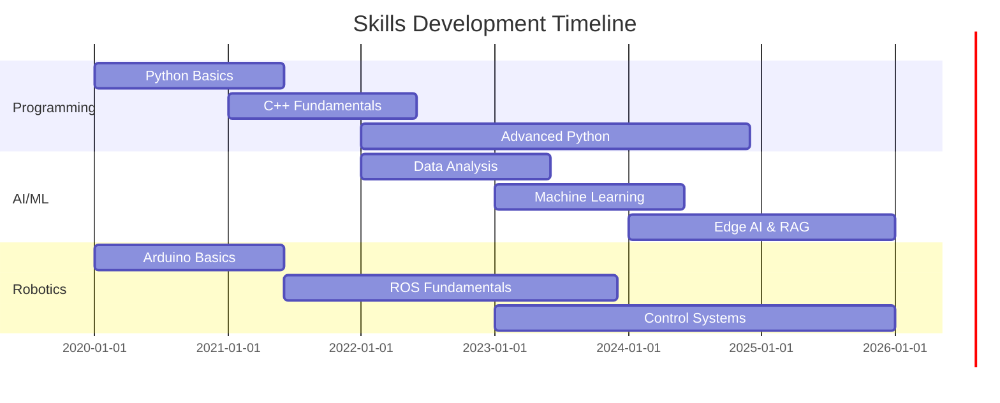

# Career Journey

> A visual timeline of my professional and academic path from 2020 to present.

---

## 2026 (Current)

### January - Present
- **Research:** 3 journal papers submitted simultaneously (May 2026)
- **Open Source:**  merged PRs into  (from  submitted)
- **Neurobotics:** 4th cohort of Python Mastery in progress

---

## 2025

### January
- **Founded Neurobotics** — Engineering services & education company
- **Founded Boundless** — Academic services company

### Awards
- **Top 3 — Ramadan Initiatives Award 2026** — Directorate of Development

### Academic
- **Research Mentorship Program RP1** — Accepted participant

---

## 2024

### Teaching
- **Paper Airplanes:** Volunteer of the Month (Fall 2025)
- **Syrian Scientific Olympiad:**  Olympic medals as coach ( gold,  silver,  bronze)
- **Neurobotics Academy:** Delivered 7+ Python and MLOps cohorts

### Projects
- Sentiment Analysis Dashboard (Local + Cloud hybrid)
- Real-Time Edge AI Emotion Detection
- Local LLM Deployment with RAG
- N8N Automation Server

---

## 2023

### Education
- Started Bachelor of Mechatronics Engineering, Aleppo University (4th year of 5)

### Teaching
- Paper Airplanes — Python & MLOps instructor (Women in Tech Program)
- Syrian National Olympiad — Physics & Robotics coach
- HerWill — Data Engineering curriculum designer

### Achievements
- Top of class (89% cumulative grade)

---

## 2022

### Work
- **Ala'a Screens Company:** Embedded Systems Designer (June - October)
  - P10 DMD screen applications
  - Basketball stadium systems
  - School bus displays

### Education
- Syrian Baccalaureate — 2313/2400 (96.375%)

---

## 2020-2021

### Freelance
- **Engineering Consultant:** 20+ projects
  - 3 graduation projects
  - 1 master's thesis
  - Full development cycle (design to prototyping)

---

## Education Timeline

| Year | Degree | Institution | Achievement |
|------|--------|-------------|-------------|
| 2027 | Bachelor of Mechatronics | Aleppo University | Expected graduation |
| 2023-2027 | Mechatronics Engineering | Aleppo University | Top of class (89%) |
| 2022 | Syrian Baccalaureate | High School | 96.375% (2313/2400) |

---

## Skills Progression

---

## Key Milestones

| Year | Milestone |
|------|-----------|
| 2020 | Started freelancing |
| 2022 | First professional job |
| 2023 | Started university |
| 2024 | First open source PR |
| 2025 | Founded two companies |
| 2026 | 3 research papers submitted |