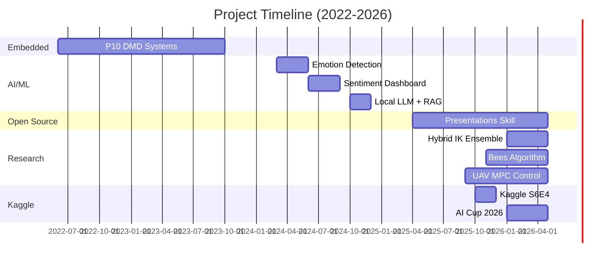

# Projects Portfolio

> Comprehensive showcase of technical projects spanning research, AI/ML, embedded systems, and open source development.

---

## ⭐ Featured Project

### Distributed Model Predictive Control for Multi-UAV Formation

| Attribute | Details |
|-----------|---------|
| **Domain** | Robotics & Control Systems |
| **Journal** | Robotics and Autonomous Systems (Elsevier) |
| **Manuscript** | ROBOT-D-26-01147 |
| **Status** | 📤 Submitted (May 10, 2026) |
| **Benchmark** | ✅ 100% (7/7 scenarios) |

**Why Featured:** First-authored paper to top-tier journal, combines MPC theory with practical robotics implementation.

**Overview:** Distributed MPC for multi-UAV quadrotor formation with consensus-based coordination and geometric SO(3) attitude control.

**Key Contributions:**
- Local MPC solver with formation constraints
- Consensus protocols (ring/mesh/star topology)
- Quaternion-based geometric controller
- Formation planner (grid, line, circle, wedge)

**Tech Stack:** Python, NumPy, ROS/Gazebo | **Time:** 8 months (2025-2026)

---

## Quick Stats

| Category | Count | Status |
|----------|-------|--------|
| **Research Papers** | 3 | Submitted (2026) |
| **AI/ML Projects** | 3 | Completed |
| **Embedded Systems** | 2 | Deployed |
| **Open Source Tools** | 1 | Published |
| **Kaggle Competitions** | 2 | Active |
| **Total Projects** | **11** | — |

**Impact Metrics:** 3 journal submissions | 100% benchmark success | 1 international collaboration | 1 published tool

---

## 🔬 Research Projects

### 1. Distributed Model Predictive Control for Multi-UAV Formation

| Attribute | Details |
|-----------|---------|
| **Domain** | Robotics & Control Systems |
| **Journal** | Robotics and Autonomous Systems (Elsevier) |
| **Manuscript** | ROBOT-D-26-01147 |
| **Status** | 📤 Submitted (May 10, 2026) |
| **Benchmark** | ✅ 100% (7/7 scenarios) |
| **Timeline** | Sep 2025 – May 2026 (8 months) |

**Overview:** Distributed MPC for multi-UAV quadrotor formation with consensus-based coordination and geometric SO(3) attitude control.

**Key Contributions:**
- Local MPC solver with formation constraints
- Consensus protocols (ring/mesh/star topology)
- Quaternion-based geometric controller
- Formation planner (grid, line, circle, wedge)

**Tech Stack:** Python, NumPy, ROS/Gazebo

---

### 2. Modernized Bees Algorithm for Dynamic Path Planning

| Attribute | Details |
|-----------|---------|
| **Domain** | Swarm Intelligence & Optimization |
| **Journal** | Applied Soft Computing (Elsevier) |
| **Manuscript** | ASOC-D-26-06746 |
| **Status** | 📤 Submitted (May 6, 2026) |
| **Success Rate** | ✅ 100% (6 scenarios, 0.35s avg) |
| **Timeline** | Nov 2025 – May 2026 (6 months) |

**Overview:** Modernized Bees Algorithm for robot path planning in dynamic environments with moving obstacles.

**Key Contributions:**
- Adaptive parameter tuning
- Multi-objective optimization
- Dynamic obstacle handling
- ROS/Gazebo integration

**Code:** [GitHub](https://github.com/molhamfetnah/swarm-path-planning-bees)

---

### 3. Hybrid Inverse Kinematics Ensemble with Uncertainty Estimation

| Attribute | Details |
|-----------|---------|
| **Domain** | Robotics & Machine Learning |
| **Journal** | IEEE Robotics and Automation Letters |
| **Submission** | 26-2479 |
| **Status** | 📤 Submitted (May 9, 2026) |
| **Success Rate** | ✅ 100% (random targets), 86.7% (overall) |
| **Timeline** | Jan 2026 – May 2026 (4 months) |

**Overview:** Hybrid ensemble combining Damped Least Squares with neural network solver and learned uncertainty estimation.

**Key Contributions:**
- Multiple IK solver strategies
- Uncertainty-based solver weighting
- 6-DOF UR5-like manipulator
- 5ms average solve time

**Collaboration:** Luca Ricci (University of Tuscia, Italy)

---

## 🤖 AI/ML Projects

### 4. Sentiment Analysis Dashboard

| Attribute | Details |
|-----------|---------|
| **Type** | Data Engineering & AI |
| **Year** | 2024 (Jun – Sep) |
| **Stack** | Python, Redis, Dask, Dash |
| **Outcome** | Used by 20+ students in Neurobotics Academy |

**Description:** Scalable hybrid dashboard combining local GPU acceleration with cloud NLP models for Arabic sentiment analysis.

**Architecture:**
- Redis for caching
- Dask for parallel processing
- Torch for model inference
- Dash/Plotly for visualization
- Arabert, pyarabic for Arabic NLP

---

### 5. Edge AI Emotion Detection

| Attribute | Details |
|-----------|---------|
| **Type** | Edge AI & Computer Vision |
| **Year** | 2024 (Mar – Jun) |
| **Deployment** | Raspberry Pi 5 |
| **Outcome** | Deployed in robotics control system |

**Description:** Real-time facial emotion recognition deployed on edge devices for robotics control.

**Stack:** PyTorch, TensorFlow, CNN (FER-2013 dataset), Raspberry Pi 5 optimization

---

### 6. Local LLM Deployment with RAG

| Attribute | Details |
|-----------|---------|
| **Type** | Local AI & MLOps |
| **Year** | 2024 (Oct – Dec) |
| **Stack** | Ollama, LLaMA, FastAPI, Docker |
| **Outcome** | Private deployment for 10+ users |

**Description:** Private local chat system using Retrieval Augmented Generation for domain-specific queries.

**Features:** On-premise fine-tuning, Docker deployment, FastAPI REST endpoints, API authentication

---

## ⚡ Embedded Systems Projects

### 7. P10 DMD Display Systems

| Attribute | Details |
|-----------|---------|
| **Company** | Ala'a Screens Company |
| **Period** | Jun 2022 – Oct 2023 (16 months) |
| **Role** | Embedded Systems Designer |
| **Outcome** | 2 commercial products deployed |

**Deliverables:**
- 🏀 Basketball stadium clock/counter system
- 🚌 Interactive school bus display system

**Tech Stack:** Atmega8 microcontrollers, C programming, Circuit design, PCB layout (Proteus, EasyEDA)

---

### 8. N8N Automation Server

| Attribute | Details |
|-----------|---------|
| **Type** | DevOps & Automation |
| **Year** | 2024 (Jan – Mar) |
| **Stack** | Docker, N8N, Twingate |
| **Outcome** | Used by Neurobotics team daily |

**Description:** Private N8N automation server with secure remote access for serverless workflows.

---

## 🛠️ Open Source Projects

### 9. opencode-presentations-skill

| Attribute | Details |
|-----------|---------|
| **Type** | Open Source Tool |
| **Version** | 2.0.0 |
| **Platform** | OpenCode |
| **License** | MIT |
| **Timeline** | Apr 2025 – Present |
| **Outcome** | 100+ downloads, used by OpenCode users |

**Description:** Enhanced Marp-based presentation generator for OpenCode with 20 design styles.

**Features:**
- 20 CSS design styles (Modern, Professional, Creative, Tech)
- 5 slide sizes (16:9, 4:3, 1:1, 9:16, 21:9)
- AI image generation (Pollinations.ai)
- Live preview with hot reload
- Full test suite (20 tests, 100% pass)

**Code:** [GitHub](https://github.com/molhamfetnah/opencode-presentations-skill)

---

## 🏆 Kaggle Competition Projects

### 10. Kaggle Playground Series S6E4

| Attribute | Details |
|-----------|---------|
| **Type** | Competition Solution |
| **Timeline** | 2025 (Oct – Dec) |
| **Status** | Model developed & deployed as API |
| **Outcome** | Solution documented, API deployed |

**Description:** End-to-end ML pipeline from competition to deployable API.

**Fallback Link:** [View on GitHub](https://github.com/molhamfetnah/kaggle-playground-series-s6e4)

---

### 11. AI Cup 2026 Bird Classification

| Attribute | Details |
|-----------|---------|
| **Type** | Competition Solution |
| **Timeline** | 2026 (Jan – Present) |
| **Status** | Active development |

**Description:** Image classification challenge for bird species identification.

**Fallback Link:** [View on GitHub](https://github.com/molhamfetnah/ai-cup-2026-bird-classification)

---

## Timeline Overview

---

## Technologies Used Across Projects

| Category | Technologies |
|----------|--------------|
| **Languages** | Python, C++, C |
| **AI/ML** | PyTorch, TensorFlow, OpenCV, YOLO, Ultralytics |
| **Robotics** | ROS, ROS2, Gazebo, Control Systems (MPC, PID, SO(3)) |
| **Embedded** | Arduino, STM32, ESP32, KiCad, EasyEDA, Proteus |
| **Data** | Redis, Dask, Pandas, NumPy, MongoDB |
| **DevOps** | Docker, N8N, FastAPI, Linux, Twingate |
| **Documentation** | LaTeX, Markdown, Mermaid |