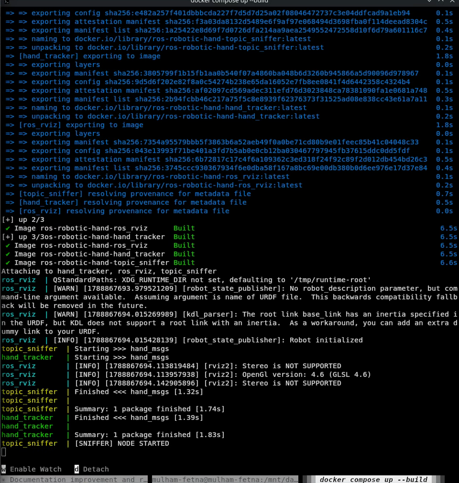


Web developers containerize to isolate processes. Roboticists containerize and then spend the rest
of the day punching holes back through the isolation — for the camera, the GPU, the display server
and the network.


ROS 2 Jazzy is hard-locked to Ubuntu 24.04. That single fact is reason enough to containerize:
without it, adopting a ROS distribution means adopting an operating system version, on every machine
that will ever run the code.

But a ROS container is a strange artifact. A web service container wants isolation — that is the
product. A robotics container needs a webcam, a GPU, a display server and multicast networking, all
of which live outside it. You end up building a box and then carefully cutting four holes in it.

Here is every hole in this project's compose file and what it is for.




flowchart TB
    subgraph HOST["🖥️ Host — Ubuntu / Kubuntu"]
        X11["X11 socket<br>/tmp/.X11-unix"]
        CAM["/dev/video0"]
        GPU["/dev/dri"]
        NET["host network<br>UDP multicast"]
    end
    subgraph C["Active containers · ROS_DOMAIN_ID=42"]
        HT["hand_tracker"]
        RV["ros_rviz"]
        TS["topic_sniffer"]
    end
    GZ["gazebo_sim<br>(commented out)"]:::parked
    classDef parked stroke-dasharray: 5 5,opacity:0.55
    CAM --> HT
    GPU --> HT
    GPU --> RV
    X11 --> HT
    X11 --> RV
    NET <--> HT
    NET <--> RV
    NET <--> TS


## Hole 1 — the network wall has to come down

```yaml
network_mode: "host"
ipc: host
pid: host
```

This is the one that breaks stacks silently, so it is worth understanding rather than copying.

By default Docker puts containers on a virtual bridge network. ROS 2 discovery runs on DDS, which
finds peers by **UDP multicast** — no broker, no registry, just nodes shouting on the local network
and listening for replies. On a bridge network, that multicast does not reach the host or sibling
containers.

The result is not an error. It is two containers that start cleanly, log normally, and never see
each other. `ros2 topic list` in one shows nothing published by the other.

- **`network_mode: "host"`** removes the virtual network entirely. The container shares the host's
  actual interface, so the tracker and RViz discover each other instantly.
- **`ipc: host`** shares the host's IPC namespace. ROS 2 passes large payloads — uncompressed frames
  and the like — through shared memory rather than over the network stack. Without a shared IPC
  namespace that fast path is unavailable, and throughput quietly degrades.

`ROS_DOMAIN_ID=42` then partitions this stack from any other ROS 2 nodes on the same machine. Two
projects on the same domain will happily discover each other's topics, which is confusing at best.

## Hole 2 — a portal to your monitor

```yaml
environment:
  - DISPLAY=${DISPLAY:-:0}
  - QT_X11_NO_MITSHM=1
volumes:
  - /tmp/.X11-unix:/tmp/.X11-unix:rw
```

Containers are headless. They have no desktop, no display server and no way to draw a window.

On Linux, X11 renders windows through a socket in `/tmp/.X11-unix`. Mounting that socket into the
container hands it a portal to your actual monitor, and `DISPLAY` tells RViz and Gazebo which screen
to draw on. `QT_X11_NO_MITSHM=1` disables the MIT shared-memory extension, which Qt applications
frequently misuse across a container boundary.

That is only half the problem. X11 is deliberately paranoid — it blocks unknown processes from
drawing on your screen, because a process that can draw on your screen can usually also read it. A
container running as root looks exactly like a hostile stranger, and you get `Authorization
required` instead of a window.

Hence the host-side setup script:

```bash
xhost +local:root
```

which tells the display server to allow local root processes to render. It is a real, if narrow,
relaxation of desktop security, scoped to local processes only.

The script also creates `/tmp/runtime-root` with mode 700, because Qt insists on an `XDG_RUNTIME_DIR`
and complains loudly when it is missing.

## Hole 3 — physical hardware

```yaml
devices:
  - /dev/video0:/dev/video0
  - /dev/dri:/dev/dri
```

**`/dev/video0`** is the webcam. Without explicit passthrough, `cv2.VideoCapture(0)` inside the
container fails, and this project's node treats that as fatal:

```python
self.cap = cv2.VideoCapture(0)
if not self.cap.isOpened():
    self.get_logger().error("Failed to open camera")
    raise RuntimeError("Camera not available")
```

Failing loudly at startup is the right call — the alternative is a node that runs happily and
publishes nothing.

**`/dev/dri`** is the Direct Rendering Infrastructure: direct access to the GPU. Without it, RViz and
Gazebo fall back to software rendering — single-digit frame rates and a pegged CPU, while the actual
graphics card sits idle. The setup script checks for `/dev/dri/renderD128` and warns if it is absent,
because "my simulation is unusably slow" is otherwise a hard symptom to trace.

## Hole 4 — live code, not baked images

```yaml
volumes:
  - ./hand_tracker/src:/ws_hand_tracker/src:ro
  - /mnt/data/projects/ros-robotic-hand:/workspace:rw
```

Baking source into the image means a rebuild for every changed constant. With a bind mount, the edit
is visible inside the running container immediately, and both Python containers re-run
`colcon build` in their entrypoint — so a change to the node, the URDF or the RViz config needs only:

```bash
docker compose restart hand_tracker
```

Rebuild only when a Dockerfile or a dependency changes.

> **The catch.** That second path is absolute. `/mnt/data/projects/ros-robotic-hand` is where *this*
> machine keeps the repository, and the URDF compounds it by referencing meshes as
> `file:///workspace/assets/*.stl`. Clone the repo anywhere else and RViz starts with no meshes until
> that line is edited. It is the single least portable thing in the project, and it is documented as
> a known defect rather than hidden.

## The command reference

Four commands that come up constantly, and what each is actually defending against.

**`xhost +local:root`** — unlocks the display server for local root processes. Without it, RViz and
Gazebo throw `Authorization required` and never render.

**`docker compose up --force-recreate`** — plain `up` wakes existing containers with their *old*
configuration. After changing X11 permissions or environment variables, force-recreate is what makes
the containers actually pick up the new state.

**`docker exec -it gazebo_sim bash`** — drops a terminal inside a running container. `exec` runs a
command in a live container, `-it` allocates an interactive TTY, and `bash` is the shell. This is how
you inspect a ROS graph from the inside rather than guessing from logs.

**`ros2 run ros_gz_sim create -file ... -z 0.5`** — injects a URDF into a running Gazebo world.
Gazebo starts as an empty universe and does not know your robot exists. The `-z 0.5` matters more
than it looks: spawn at `z=0` and the hand's collision meshes intersect the ground plane, and the
physics solver resolves that interpenetration by launching the model violently into the sky.

## The Gazebo path, honestly

`gazebo_sim` is the newest and least finished service — and it is currently **commented out** in
`docker-compose.yml`, which is why the build log above shows three images rather than four. Its
entrypoint automates what was originally a manual sequence:

```bash
gz sim empty.sdf &
sleep 4                      # let the physics server initialize its transport
ros2 run ros_gz_sim create -file /workspace/ros_rviz/urdf/robot.urdf \
    -name robotic_hand -z 0.5
wait $GZ_PID
```

That `sleep 4` is a race condition wearing a disguise. Gazebo's transport layer takes a moment to
come up, and spawning too early fails silently. Four seconds works on this machine; the correct fix
polls for readiness rather than guessing.

**And the model does not yet do anything there.** The URDF has real inertias — masses from 1.86 g to
61 g with full tensors, computed from Onshape material assignments — so the common blocker of
zero-mass links does not apply here. What it lacks is actuation: no `<transmission>` blocks, no
`<gazebo>` plugin loading `gz_ros2_control`, and therefore no controller subscribing to commands.

Spawned as-is, the hand is a passive rigid-body assembly. It falls under gravity, its joints swing
freely, and `/joint_states` does not drive it, because nothing in the simulation is listening.

The distinction is worth being precise about:

| | RViz — working today | Gazebo — aspirational |
|---|---|---|
| What it shows | What the robot believes about itself | What physics would do to it |
| Needs | `/tf` from `robot_state_publisher` | Inertials ✅ · transmissions ❌ · controllers ❌ |
| Status | Running | Commented out until there is something to drive |
| Answers | "Do my tracked angles match the twin?" | "Can this hand hold a ball?" |

Closing that gap is controller plumbing, not CAD work — and it is the next substantial piece of the
project.

## Two warnings you will see every time

The build log above contains both, and neither is noise.

```text
[WARN] [kdl_parser]: The root link base_link has an inertia specified in the URDF, but KDL does
not support a root link with an inertia.

[WARN] [robot_state_publisher]: No robot_description parameter, but command-line argument
available. ... This backwards compatibility fallback will be removed in the future.
```

The first says the exporter's `addDummyBaseLink` wrote a `1e-09` mass on the root link, and KDL
wants the root to carry no `<inertial>` block at all. Harmless today — nothing integrates the
root's dynamics — but a real objection rather than a clean bill of health.

The second is a deprecation with a deadline. The compose command passes the URDF as a positional
argument; the supported form sets the `robot_description` parameter with the file's *contents*,
most naturally from a launch file. It works now and will stop working eventually.

Reading your own startup logs is unglamorous and repeatedly worth it. Both of these were sitting in
plain text through every single run of this project before anyone read them carefully.

## What you should take away

- **Robotics containers invert the usual goal.** You isolate, then deliberately un-isolate for
  hardware and multicast.
- **DDS on a bridge network fails silently.** Host networking is not an optimization here; it is a
  requirement.
- **Bind-mount your source.** A three-minute rebuild per constant change destroys the debugging
  loop that robotics work depends on.
- **Absolute paths in a compose file are a portability bug**, even when they work perfectly on the
  machine that wrote them.

---

That completes the series — camera to CAD, and every layer in between.

**[← Back to the project](/projects/ros2-mediapipe-robotic-hand-digital-twin-vision-teleoperation/)** ·
[the code and DOI on GitHub](https://github.com/mulhamfetna/ros2-mediapipe-robotic-hand-digital-twin-vision-teleoperation)
