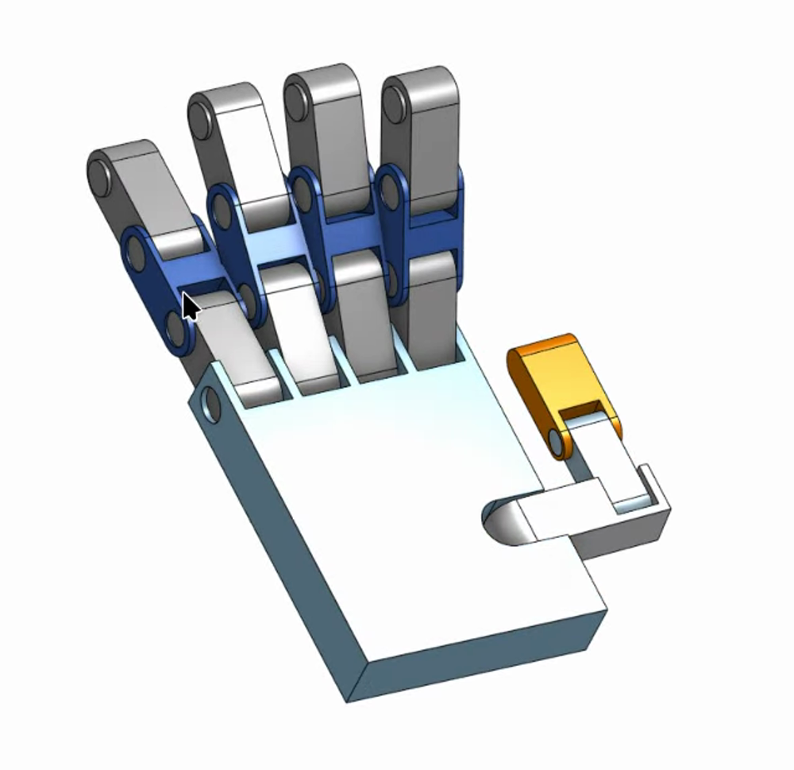


Bridging a modern parametric CAD platform and a fifteen-year-old XML standard is where most
roboticists lose days. The exporter translates exactly what it sees — so every shortcut taken in CAD
becomes a bug in ROS.


**[→ Open the assembly on Onshape](https://cad.onshape.com/documents/a2dbb5f16624f10f1aa22f02/w/3eff80c19eddad52bfa92f87/e/4d69727744037003575f4068)** —
it is public, so everything below is checkable against the source.



`onshape-to-robot` is a compiler. Assembly in, robot description out. It reads mate names, mate
limits and material densities directly from the CAD document and writes them into URDF as joint
names, joint limits and inertia tensors.

That is a genuinely good deal — done properly, the physical properties of your robot are *generated*
rather than hand-typed, and they stay correct when the mechanism changes. Done improperly, you spend
your evenings editing XML by hand and discovering that your ring finger has no knuckle.


flowchart LR
    A["Onshape assembly<br>mates · limits · materials"] --> B["onshape-to-robot<br>API pull"]
    B --> C["robot.urdf<br>links · joints · inertials"]
    B --> D["assets/*.stl<br>visual + collision meshes"]
    C --> E["robot_state_publisher"]
    C --> F["JOINT_MAPPING<br>limits transcribed by hand"]
    D --> G["RViz / Gazebo"]


## Five rules that move work back into CAD

Each of these exists because its absence cost real time on this project.

### 1. Mate names are joint names

 tree is the real contract between CAD and code.")

The exporter's convention is the **`dof_` prefix**. A mate named `dof_index_mcp` is exported as a
joint; a revolute mate *without* the prefix is exported as a rigid weld. The prefix is then
**stripped**, so `dof_index_mcp` becomes `<joint name="index_mcp">`.

That is why the tree above reads `dof_twinky_dip`, `dof_ring_mcp`, `dof_thumb_pip`, while the URDF
reads `twinky_dip`, `ring_mcp`, `thumb_pip` — and why whatever you type after the prefix has to
match a string in the Python mapping table, character for character.

**The trap.** It is easy to leave mates named `Revolute 1`, or to carry a legacy name from an old
iteration.

**Worse:** duplicating a finger sub-assembly in Onshape copies its mates **and their names**. Two
joints then share one name, and the exporter resolves the collision by dropping one.

**The fix.** Rename every moving mate to its final ROS name before exporting — `index_mcp`,
`thumb_dip` — and after duplicating a sub-assembly, go into the copy and rename its mates
individually.

### 2. Set limits in the CAD, not in Python

**The trap.** Exported joints that are free-spinning or carry generic bounds force you to build a
translation table in software — which is exactly what `JOINT_MAPPING` is, and exactly why it can
drift out of sync.

**The fix.** Double-click every revolute mate, tick **Limits**, and enter the true mechanical
minimum and maximum. The exporter converts to radians and bakes them into `<limit lower= upper=>`
automatically.

### 3. Revolute joints rotate about Z

**The trap.** Mate parts casually and your fingers bend about X in Onshape. Import to RViz and the
coordinate maths gets twisted — fingers bend sideways, or a digit inverts through the palm.

**The fix.** Use *Realign Secondary Axis* when creating each mate so the blue Z arrow points
directly down the hinge pin. Every knuckle, every time.

There is no error message for getting this wrong. The transform maths remains perfectly valid; it is
simply describing the wrong hinge.

### 4. Assign materials — the Gazebo tax

**The trap.** RViz only needs the mesh. A physics engine refuses to work with links that have no
mass or inertia, and a part left as generic geometry exports with nothing.

**The fix.** Right-click every part (bulk-select works) and **Assign Material** — ABS plastic,
aluminium, whatever it will actually be made from. The exporter uses that density to compute the
full `ixx` / `iyy` / `izz` inertia matrix.

Skip it and Gazebo receives zero-mass links, and the physics solver collapses the model instantly.

### 5. Give it a `base_link`

**The trap.** Export a bare hand and ROS has no idea how it attaches to the universe, producing TF
tree errors.

**The fix.** Create a tiny dummy part or coordinate frame named `base_link` and fasten-mate it to the
palm. That becomes the URDF's root anchor and aligns with standard ROS coordinate conventions.

## Setting the exporter up

The tool is a Python CLI. STL mesh processing needs OpenSCAD present:

```bash
sudo apt-get install openscad
pip install onshape-to-robot
```

### Authentication

It reads your CAD over the Onshape API, so it needs keys from the
[Onshape developer portal](https://dev-portal.onshape.com/keys), in a local `.env`:

```env
ONSHAPE_API=https://cad.onshape.com
ONSHAPE_ACCESS_KEY=your_access_key_here
ONSHAPE_SECRET_KEY=your_secret_key_here
```

These are credentials to your CAD account. Gitignore the file before you write it, not after.

### The configuration

`config.json` tells the exporter which document to pull and how to format the output. The document
and workspace IDs come straight out of the Onshape URL
(`cad.onshape.com/documents/[documentId]/w/[workspaceId]`):

```json
{
  "documentId": "a2dbb5f16624f10f1aa22f02",
  "workspaceId": "3eff80c19eddad52bfa92f87",
  "elementId": "4d69727744037003575f4068",
  "outputFormat": "urdf",
  "simplifyStl": false,
  "addDummyBaseLink": true,
  "jointMaxEffort": 1.0,
  "jointMaxVelocity": 2.0
}
```

Two flags are load-bearing and worth stating explicitly:

- **`mergeSTLs` must be `"no"`.** Set it to merge and the visual meshes are fused into single rigid
  bodies — which destroys the articulated knuckles you spent the CAD time building.
- **`ignoreLimits` must be `false`.** Setting it true discards the mate limits from rule 2, which are
  precisely the numbers the kinematic mapping depends on.

`addDummyBaseLink` is the automated version of rule 5.

Then run it against the directory holding those two files:

```bash
onshape-to-robot ./onshape_export
```

A successful run produces the URDF, a populated mesh directory, and terminal output confirming
extraction of `mass`, `ixx`, `iyy` and `izz` for every part. If those inertia values are absent or
zero, rule 4 was skipped.

## What this export actually produced

Honest accounting, verified against the files as they currently stand.

### ✅ Inertials are correct

This is worth leading with, because it is commonly assumed to be the blocker and here it is not. The
parts carried material assignments, so every link got real physical properties:

```xml
<inertial>
  <origin xyz="0.0366664 0.0353317 0.1069" rpy="0 0 0"/>
  <mass value="0.0611462"/>
  <inertia ixx="2.7277e-05" ixy="-0" ixz="8.34061e-07"
           iyy="4.36562e-05" iyz="-0" izz="1.87189e-05"/>
</inertial>
```

Masses run from 1.86 g at the fingertips to 61 g for the palm, with full tensors. `base_link` alone
carries the conventional `1e-09` dummy mass, which is correct for a massless root.

So the reason the Gazebo path does not yet give a working physics twin is **not missing inertia**. It
is that the URDF describes geometry without actuation: no `<transmission>` blocks, no `<gazebo>`
plugin loading `gz_ros2_control`, and therefore no controller listening. Spawned as-is, the hand is a
passive assembly that falls under gravity while its joints swing freely. Closing that gap is
controller plumbing, not CAD.

### ✅ Every joint axis is on local Z

Rule 3 held — all fifteen revolute joints export as `<axis xyz="0 0 1"/>`. Recorded here as a
positive control, because it is worth re-checking after every export.

### ⚠️ The pinky is called `twinky`

A legacy mate name that propagated into the URDF and then into the Python mapping, because
`JointState` matches by exact string.

Renaming is a three-place atomic edit — the Onshape mates, the URDF, and `JOINT_MAPPING`. Do two of
the three and the pinky silently stops moving while everything else works. It was left alone
deliberately: the cost is cosmetic and the risk of a partial rename is not. The real fix belongs
upstream in the CAD, before the next export.

### ✅ The missing ring MCP — fixed

The first export produced no distinct `ring_mcp`. This is rule 1's failure mode exactly: the
duplicated ring sub-assembly arrived carrying the pinky's `twinky_mcp`, the names collided, and one
was dropped. The ring finger had no base knuckle.

The URDF now has a properly distinct `ring_mcp` with its own limits. A stale comment in the source
still describes the manual patch, and should be deleted.

### ✅ `ring_mcp` limits were out of sync — now fixed

The one genuine numerical defect. Fourteen mapping rows transcribed their joint's limits exactly;
this one did not:

| Source | Open | Closed |
|---|---|---|
| `JOINT_MAPPING` (before) | `0.000` | `-1.571` |
| `<limit>` in the URDF | `0.39671` | `-1.17409` |

At full curl the node commanded roughly 23° past the joint's mechanical stop. Nothing errored,
because `robot_state_publisher` does not enforce limits — it applies whatever transform it is
handed.

It was a direct consequence of rule 2 being applied *late*: the joint originally had generic
bounds, the table was written against those, the CAD gained a real limit, and the table was never
revisited. The row now reads `('ring_mcp', 9, 0.397, -1.174)`.

The durable fix is different and still outstanding: **parse the limits out of the URDF at startup**
rather than transcribing them, so the two representations cannot disagree in the first place. A
corrected constant fixes today's bug; reading from one source fixes the class of bug.

### ⚠️ Two warnings at every startup

Both are visible in the build log the moment `robot_state_publisher` initializes, and both are
worth knowing about.

```text
[WARN] [kdl_parser]: The root link base_link has an inertia specified in the URDF, but KDL does
not support a root link with an inertia. As a workaround, you can add an extra dummy link.

[WARN] [robot_state_publisher]: No robot_description parameter, but command-line argument
available. Assuming argument is name of URDF file. This backwards compatibility fallback will
be removed in the future.
```

The first is the flip side of the inertia story above: `addDummyBaseLink` writes a `1e-09` mass on
the root, and KDL wants the root to carry *no* `<inertial>` block at all rather than a negligible
one. Harmless — the root is fixed to the world and nothing integrates its dynamics — but it is a
real objection, not a clean bill of health.

The second has a deadline. The compose command passes the URDF as a positional argument, which is
a compatibility shim scheduled for removal. The supported form sets the `robot_description`
parameter with the URDF's *contents*, most cleanly from a launch file.

### ⚠️ Mesh paths are absolute container paths

The 32 mesh references do not use the conventional `package://` scheme:

```xml
<mesh filename="file:///workspace/assets/part_4.stl"/>
```

This works because the compose file bind-mounts the repository at `/workspace`, and it avoids
needing a real ROS package with an `ament_index` entry just to resolve meshes. The costs are real:
the URDF cannot load outside a container, the bind-mount source is itself an absolute host path — so
cloning the repository anywhere else breaks both — and re-exporting overwrites the patch every time.

The portable version wraps the description in a `hand_description` package and uses
`package://hand_description/assets/part_4.stl`.

## The summary

| # | Item | Status | Cost if ignored |
|---|---|---|---|
| 1 | Pinky named `twinky` | Open, cosmetic | Confusion only |
| 2 | `ring_mcp` limits mismatch | Fixed | Commanded 23° past the stop |
| 3 | Missing `ring_mcp` joint | Fixed | — |
| 4 | Absolute mesh paths | Patched, fragile | Repo not relocatable; patch lost on re-export |
| 5 | Inertials | Correct | — |
| 6 | Joint axes | Correct | — |
| 7 | Deprecated `robot_description` argument | **Open** | Breaks on a future ROS 2 release |

Nothing here changes what appears on screen today. Defect 4 is the one that will bite the next
person who clones the repository; defect 7 is the one with a removal notice attached.

## What you should take away

- **The exporter is faithful, not forgiving.** It writes exactly what your CAD says, including your
  mistakes.
- **Duplicating a sub-assembly duplicates mate names**, and the collision is resolved by silently
  dropping a joint.
- **Every rule you apply in CAD deletes code in Python.** Limits set in Onshape are limits you never
  transcribe — and therefore limits that can never drift.
- **Audit after every re-export.** Joint names, axes, limits and inertias, in that order.
- **A corrected constant is not a fix.** If a number lives in two files, read it from one.

Next: getting all of this to run inside containers without losing the webcam, the GPU or the display.

**[→ Part 6: Containerizing ROS 2 without losing the hardware](/projects/ros2-mediapipe-robotic-hand-digital-twin-vision-teleoperation/docker-gazebo/)**
