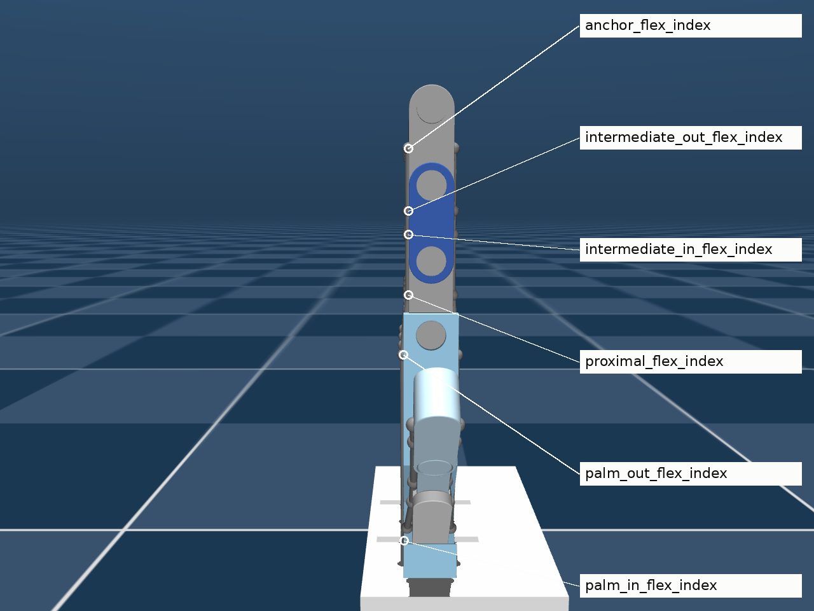
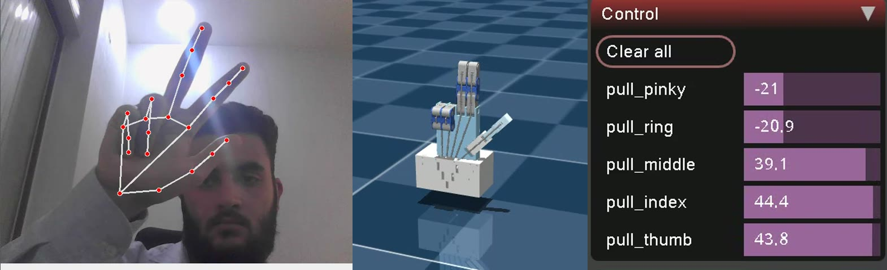
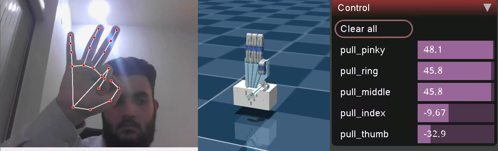




Hold your hand up to a webcam and a physics-simulated robotic hand — five strings, fifteen passive
knuckles, designed in CAD — closes its fingers when you close yours.



This is the successor to my [ROS 2 MediaPipe robotic hand](/projects/ros2-mediapipe-robotic-hand-digital-twin-vision-teleoperation/).
That project animated a 15-DOF hand by *setting joint angles* in RViz. This one takes the harder,
more physical route: the hand is **tendon-driven and underactuated**, like most 3D-printed and
many research hands. Each finger has one flexor string pulled from the palm, and MuJoCo decides how
that single pull curls three passive joints.


MediaPipe Hands
MuJoCo 3.13 spatial tendons
ROS 2 Jazzy in Docker Compose
Onshape → MJCF
AGPL-3.0 · Zenodo DOI


The code is open under AGPL-3.0 and DOI-archived
([10.5281/zenodo.22775694](https://doi.org/10.5281/zenodo.22775694)), the
[Onshape assembly is public](https://cad.onshape.com/documents/a2dbb5f16624f10f1aa22f02/w/693ffc0be3e83ae21f78f6ed/e/4d69727744037003575f4068?renderMode=0),
and every number in the series below was measured on the repository.

Get the code on GitHub
Run it in 10 minutes

## The pipeline


flowchart TB
    subgraph V["🐳 vision_tracker"]
        direction LR
        A["📷 Webcam"] --> B["MediaPipe Hands<br>21 landmarks"]
        B --> C["3 knuckle angles<br>per finger → mean"]
        C --> D["Flexion<br>0.0 open · 1.0 closed"]
    end
    subgraph T["🐳 mujoco_twin"]
        direction LR
        E["Lerp → ±50 N"] --> F["Tendon motor<br>pull_{finger}"]
        F --> G["Spatial tendon<br>through 6 sites"]
        G --> H["🖐️ MuJoCo viewer"]
    end
    D -- "ROS 2 · /hand/target_flexions<br>sensor_msgs/JointState" --> E


Two containers share the host network (DDS discovery, visible across the LAN) and the host's
shared memory (Fast DDS moves messages through `/dev/shm`). The code is bind-mounted, not baked into
the images, so an edit is a `docker compose restart` away.

| From CAD… | …to a simulated tendon routing |
|---|---|
|  |  |

## Watch it



## What the measurements showed

Building the documentation meant measuring the system instead of describing it. Three results
stood out, and each gets its own article:


**The simulated fingers are switches.** With force control and zero joint stiffness, **−1 N** of
tendon pull closes a finger to its 90° stop — 1% of the ±50 N command range. Position control on
tendon length gives a smooth curl instead. → [Part 11](/projects/ros2-tendon-driven-hand-mujoco-digital-twin-vision-teleoperation/tendon-physics-switch/)




**Image-normalized MediaPipe landmarks bend angles.** A true 90° bend reads **73.7°** when rotated
45° in a 640×480 frame, because x and y are divided by different image dimensions. World landmarks
fix it. → [Part 4](/projects/ros2-tendon-driven-hand-mujoco-digital-twin-vision-teleoperation/mediapipe-hands/)



**Docker costs nothing; a second OpenGL window does.** MediaPipe takes 19.0 ms per frame in the
container and 19.2 ms on the host — but 55–86 ms whenever a MuJoCo viewer renders at the same time,
with or without Docker. → [Part 19](/projects/ros2-tendon-driven-hand-mujoco-digital-twin-vision-teleoperation/latency-benchmark/)


| Peace sign | OK sign |
|---|---|
|  |  |

*Each frame shows all three layers at once: tracked hand, simulated hand, and the live tendon forces.*

## The 20-part series

Written as a tutorial you can follow end to end, or dip into by layer. Each part is self-contained
and links to the exact files in the repository.

### Getting started
1. **[Run the tendon-driven hand digital twin](/projects/ros2-tendon-driven-hand-mujoco-digital-twin-vision-teleoperation/quickstart/)** — Docker Compose, a single Python script, the twin alone, or the model viewer.
2. **[How a webcam moves a simulated tendon-driven hand](/projects/ros2-tendon-driven-hand-mujoco-digital-twin-vision-teleoperation/architecture/)** — the whole system on one page. Start here if you only read one.
3. **[Troubleshooting and FAQ](/projects/ros2-tendon-driven-hand-mujoco-digital-twin-vision-teleoperation/troubleshooting-faq/)** — every error hit while building it, and the fix.

### Vision — pixels to finger flexion
4. **[MediaPipe Hands and the 16° angle trap](/projects/ros2-tendon-driven-hand-mujoco-digital-twin-vision-teleoperation/mediapipe-hands/)** — the two-stage model, 21 landmarks, and what the coordinates really mean.
5. **[Joint angles from three landmarks](/projects/ros2-tendon-driven-hand-mujoco-digital-twin-vision-teleoperation/joint-angles-dot-product/)** — dot-product geometry and its two numerical traps.
6. **[Why three knuckles become one number](/projects/ros2-tendon-driven-hand-mujoco-digital-twin-vision-teleoperation/underactuation-averaging/)** — underactuation, and what averaging throws away.
7. **[Normalizing finger curl](/projects/ros2-tendon-driven-hand-mujoco-digital-twin-vision-teleoperation/flexion-normalization/)** — the inverted min-max formula and where its constants come from.
8. **[Why the thumb gets its own thresholds](/projects/ros2-tendon-driven-hand-mujoco-digital-twin-vision-teleoperation/thumb-thresholds/)** — a saddle joint, a narrow window, and its trade-off.
9. **[Calibrating hand tracking to your hand](/projects/ros2-tendon-driven-hand-mujoco-digital-twin-vision-teleoperation/calibration/)** — a procedure, and real flexions from a live session.

### Actuation — flexion to finger motion
10. **[From finger flexion to tendon force](/projects/ros2-tendon-driven-hand-mujoco-digital-twin-vision-teleoperation/flexion-to-force/)** — linear interpolation, actuator lookup, and a string that pushes.
11. **[Why the simulated finger is a switch](/projects/ros2-tendon-driven-hand-mujoco-digital-twin-vision-teleoperation/tendon-physics-switch/)** — the measurement, the force balance, and three tested fixes.

### Model — Onshape CAD to MuJoCo
12. **[From an Onshape assembly to MuJoCo](/projects/ros2-tendon-driven-hand-mujoco-digital-twin-vision-teleoperation/onshape-to-mujoco/)** — the current design, `onshape-to-robot`, and `config.json`.
13. **[The manual MJCF edits behind a tendon hand](/projects/ros2-tendon-driven-hand-mujoco-digital-twin-vision-teleoperation/mjcf-edits/)** — tendons, the "horn hack", contacts that never happen, and motors.
14. **[Inside the MuJoCo tendon hand model](/projects/ros2-tendon-driven-hand-mujoco-digital-twin-vision-teleoperation/model-anatomy/)** — kinematic tree, joint sign conventions, site naming.

### ROS 2 and containers
15. **[The ROS 2 topic contract](/projects/ros2-tendon-driven-hand-mujoco-digital-twin-vision-teleoperation/ros2-topic-contract/)** — one topic, two nodes, and pumping `rclpy` inside a render loop.
16. **[Docker Compose architecture for ROS 2](/projects/ros2-tendon-driven-hand-mujoco-digital-twin-vision-teleoperation/docker-compose-architecture/)** — dependency-only images and mounted code.
17. **[Shared network and shared memory in Docker](/projects/ros2-tendon-driven-hand-mujoco-digital-twin-vision-teleoperation/ros2-docker-network-shared-memory/)** — DDS discovery, domain IDs, LAN visibility, and Fast DDS SHM across containers.
18. **[GUI, webcam and GPU passthrough](/projects/ros2-tendon-driven-hand-mujoco-digital-twin-vision-teleoperation/docker-gui-camera-gpu/)** — X11 on Wayland, `/dev/dri`, `/dev/video0`, and the cost of `privileged`.

### Performance and production
19. **[What limits the frame rate](/projects/ros2-tendon-driven-hand-mujoco-digital-twin-vision-teleoperation/latency-benchmark/)** — a benchmark, what it ruled out, and the leading hypothesis.
20. **[Roadmap to production](/projects/ros2-tendon-driven-hand-mujoco-digital-twin-vision-teleoperation/roadmap-to-production/)** — correctness, robustness, maintainability, real servos, deployment.

## What it does not do (yet)

- **Partial poses.** The twin mirrors open and closed fingers, not a half-curl — see Part 11 and
  [issue #1](https://github.com/mulhamfetna/ros2-tendon-driven-hand-mujoco-digital-twin-vision-teleoperation/issues/1).
- **Hardware.** It simulates commands; the SG90 servos in the CAD are not driven yet (Part 20).
- **Self-collision.** No geom pair in the model ever produces a contact (Part 13).
- **Smoothing.** Landmark jitter passes straight through to the tendon forces.

## Frequently asked questions




An open-source project by Mulham Fetna in which a standard RGB webcam and Google MediaPipe Hands track a person's hand, and a MuJoCo physics simulation of an underactuated, tendon-driven robotic hand mirrors it in real time. Vision and simulation run as two ROS 2 Jazzy Docker containers that exchange five finger-flexion values over the topic /hand/target_flexions. The code is AGPL-3.0 licensed and archived on Zenodo under DOI 10.5281/zenodo.22775694.



In this project each finger has a MuJoCo spatial tendon routed through six named sites from the palm to the fingertip, and a motor actuator applies a force along that tendon. The three finger joints are passive hinges, so MuJoCo's solver decides how one tendon pull curls all three. The measured consequence is that with zero joint stiffness about −1 N of pull closes a finger fully, so position control of tendon length is recommended for proportional motion.



No depth camera, gloves, or markers are needed — any RGB webcam works, because MediaPipe infers 3D hand landmarks from single 2D frames. MediaPipe runs on the CPU at about 19 ms per frame on a laptop; the MuJoCo viewer runs well on integrated Intel graphics.



Both services use Docker Compose network_mode host so DDS discovery over UDP multicast works between containers and across the LAN (ROS_DOMAIN_ID 42, discovery range SUBNET), and ipc host plus pid host so Fast DDS can pass messages through shared memory segments in /dev/shm instead of the network stack.



Cite the Zenodo concept DOI 10.5281/zenodo.22775694, which always resolves to the latest version: Fetna, Mulham Mohammed, "Tendon-Driven Robotic Hand: Vision-Teleoperated MuJoCo Digital Twin", Zenodo. The GitHub repository also provides a CITATION.cff file.




## Cite it

```bibtex
@software{fetna_tendon_hand_mujoco_twin,
  author    = {Fetna, Mulham Mohammed},
  title     = {{Tendon-Driven Robotic Hand: Vision-Teleoperated MuJoCo Digital Twin}},
  year      = {2026},
  publisher = {Zenodo},
  doi       = {10.5281/zenodo.22775694},
  url       = {https://doi.org/10.5281/zenodo.22775694}
}
```
