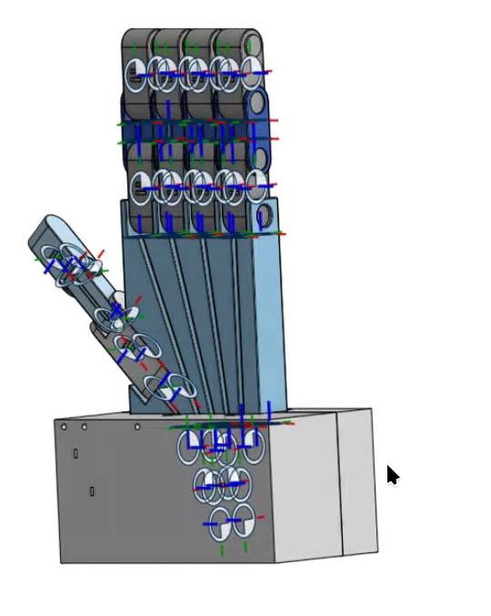


One vision container turns webcam frames into five numbers. One simulation container turns those
numbers into tendon forces. Everything else in this series is detail inside one of those two boxes
— or the pipe between them.


, simulation (the twin), actuation (live motor forces from MuJoCo's Control panel).")

## End to end


flowchart LR
    subgraph VISION["🐳 vision_tracker container"]
        direction TB
        A["Webcam frame 640×480 BGR"] --> B["MediaPipe Hands 21 landmarks"]
        B --> C["3 knuckle angles / finger dot product"]
        C --> D["mean → 1 curl angle (underactuation)"]
        D --> E["normalize + clip flexion 0..1"]
    end
    subgraph TWIN["🐳 mujoco_twin container"]
        direction TB
        F["lerp +50 N … −50 N"] --> G["data.ctrl on pull_{finger} motor"]
        G --> H["spatial tendon through 6 sites"]
        H --> I["3 passive hinge joints curl"]
        I --> J["MuJoCo viewer"]
    end
    E -- "ROS 2 · /hand/target_flexions sensor_msgs/JointState" --> F


| Stage | What comes out | Deep dive |
|---|---|---|
| MediaPipe Hands | 21 (x, y, z) landmarks per frame | [Part 4](/projects/ros2-tendon-driven-hand-mujoco-digital-twin-vision-teleoperation/mediapipe-hands/) |
| Triplet angles | 3 interior angles per finger, in radians | [Part 5](/projects/ros2-tendon-driven-hand-mujoco-digital-twin-vision-teleoperation/joint-angles-dot-product/) |
| Averaging | 1 curl angle per finger | [Part 6](/projects/ros2-tendon-driven-hand-mujoco-digital-twin-vision-teleoperation/underactuation-averaging/) |
| Normalization | flexion 0..1 (the thumb has its own window) | [Parts 7](/projects/ros2-tendon-driven-hand-mujoco-digital-twin-vision-teleoperation/flexion-normalization/)–[8](/projects/ros2-tendon-driven-hand-mujoco-digital-twin-vision-teleoperation/thumb-thresholds/) |
| ROS 2 topic | `JointState`: names are fingers, positions are flexions | [Part 15](/projects/ros2-tendon-driven-hand-mujoco-digital-twin-vision-teleoperation/ros2-topic-contract/) |
| Lerp | force in newtons per tendon | [Part 10](/projects/ros2-tendon-driven-hand-mujoco-digital-twin-vision-teleoperation/flexion-to-force/) |
| Tendon physics | joint angles | [Part 11](/projects/ros2-tendon-driven-hand-mujoco-digital-twin-vision-teleoperation/tendon-physics-switch/) |

## Why the pipe carries flexions, not angles or forces

The contract between the containers is five unitless numbers: 0.0 is an open finger, 1.0 is a closed
one. That choice is the architecture.

- **The vision side never learns about the robot.** It doesn't know the hand has tendons, how strong
  the motors are, or how the joints are signed. Recalibrate it, swap MediaPipe for a data glove — the
  simulator doesn't notice.
- **The robot side never learns about cameras.** Change ±50 N to a position servo, or replace MuJoCo
  with real SG90 servos — the tracker doesn't notice.
- **Anyone can listen.** A `ros2 topic echo` on another laptop, a `rosbag` recording, a future
  hardware driver — all consume the same five numbers.

## Three sources of truth


flowchart TB
    CAD["Onshape assembly (geometry, mates, limits)"] -->|"onshape-to-robot config.json"| MJCF["robot.xml + assets/ + tendons.xml (injected) + manual defaults/actuators"]
    MJCF -->|"include"| SCENE["scene.xml"]
    SCENE --> SIM["mujoco_twin_node.py"]
    CODE["HandTracker / DigitalTwin classes (standalone/main.py = reference)"] --> SIM
    CODE --> VIS["vision_tracker_node.py"]
    COMPOSE["docker-compose.yml + Dockerfiles"] --> SIM
    COMPOSE --> VIS


| Layer | Source of truth | Regenerated from |
|---|---|---|
| Mechanical design | the [Onshape assembly](https://cad.onshape.com/documents/a2dbb5f16624f10f1aa22f02/w/693ffc0be3e83ae21f78f6ed/e/4d69727744037003575f4068?renderMode=0) | — |
| Simulation model | `mujoco_twin/model/robot.xml` | the CAD, plus manual edits re-applied after export |
| Control logic | the classes in `standalone/main.py` | copied into both nodes (a known smell — Part 20) |
| Runtime | `docker-compose.yml` | — |

| Onshape — the design | MuJoCo — the twin |
|---|---|
|  |  |

## Two ways to run the same logic

| | `standalone/main.py` | Docker Compose + ROS 2 |
|---|---|---|
| Processes | 1 | 2 containers |
| Loop | camera → vision → physics → render, in lockstep | independent: vision at camera rate, physics in real time |
| Coupling | a function call | the `/hand/target_flexions` topic |
| Best for | learning the algorithm, quick experiments | swapping endpoints, networking, deployment |
| On the development laptop | visibly smoother | ~11 Hz vision while the viewer is open ([Part 19](/projects/ros2-tendon-driven-hand-mujoco-digital-twin-vision-teleoperation/latency-benchmark/)) |

## The one behaviour to know before anything else

The twin is smooth on the vision side and **binary** on the physics side. Any flexion above about
0.51 closes a finger completely; anything below 0.5 pushes it open.

That is why the live demo looks crisp and why a half-closed hand can't be mirrored yet — measured,
explained and fixed in simulation in [Part 11](/projects/ros2-tendon-driven-hand-mujoco-digital-twin-vision-teleoperation/tendon-physics-switch/).

## At a glance

| Fact | Value |
|---|---|
| Actuated tendons | 5 flexors, ±50 N motors |
| Passive joints | 15 knuckles with 90° limits |
| On the wire | 5 floats, up to 30 Hz |
| Discovery | `ROS_DOMAIN_ID=42`, LAN-visible |
| Pinned versions | MediaPipe 0.10.14 (container) / 0.10.11 (standalone), MuJoCo 3.13.0, ROS 2 Jazzy |
| License · DOI | AGPL-3.0 · [10.5281/zenodo.22775694](https://doi.org/10.5281/zenodo.22775694) |
