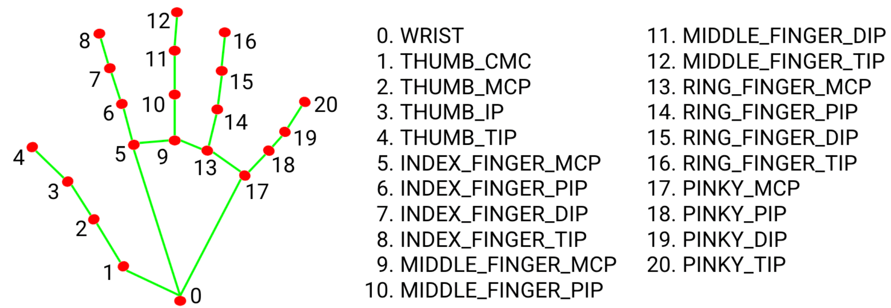


Twenty-one points per frame, on a laptop CPU, from a flat RGB image. That is what MediaPipe hands
to a robot. It is easy to treat as a black box — until you compute angles from it and discover the
box stretched your coordinate space.


## Where MediaPipe sits


flowchart TB
    CAM["USB webcam<br>640×480 @ 30 fps · YUYV"] -->|"BGR frame"| RGB["cv2.cvtColor<br>BGR → RGB"]
    RGB --> MP["MediaPipe Hands<br>palm detector + landmark model"]
    MP -->|"21 × (x, y, z)"| ANG["Triplet angles<br>Part 5"]
    ANG --> AVG["Average per finger<br>Part 6"]
    AVG --> NORM["Flexion 0..1<br>Parts 7–8"]
    NORM -->|"/hand/target_flexions"| TWIN["MuJoCo twin"]


The vision layer knows nothing about MuJoCo. Its entire output is **five numbers between 0.0 (open)
and 1.0 (closed)**.

## Two networks, not one

MediaPipe Hands is a **cascade**:

1. **BlazePalm**, a single-shot detector, finds a *palm* bounding box in the full frame. Palms, not
   hands: a palm is close to a rigid square; a hand with moving fingers is not.
2. **A landmark model** crops that region and regresses 21 keypoints, a hand-presence score and
   handedness.

In video mode (`static_image_mode=False`) the detector barely runs. Landmarks from frame *t* define
the crop for frame *t+1*, and the detector wakes only when tracking confidence drops. That shortcut
is why this pipeline holds 30 fps on a CPU.

| Setting | Value | Effect |
|---|---|---|
| `static_image_mode` | `False` | Detector runs only when tracking is lost |
| `max_num_hands` | `1` | A second hand in view is ignored |
| `min_detection_confidence` | `0.5` | Palm-detector threshold |
| `min_tracking_confidence` | `0.5` | Below it, the next frame re-detects |


**Version pin.** The code uses the legacy `mp.solutions.hands` API: `mediapipe==0.10.14` in the
container, `0.10.11` in the Python 3.10 standalone venv. Newer releases removed it in favour of the
Tasks API (`HandLandmarker`). Don't unpin without migrating.


## The 21 landmarks



| Finger | Landmarks, base → tip | Joints between them |
|---|---|---|
| Thumb | 1 (CMC), 2 (MCP), 3 (IP), 4 (tip) | CMC, MCP, IP |
| Index | 5, 6, 7, 8 | MCP, PIP, DIP |
| Middle | 9, 10, 11, 12 | MCP, PIP, DIP |
| Ring | 13, 14, 15, 16 | MCP, PIP, DIP |
| Pinky | 17, 18, 19, 20 | MCP, PIP, DIP |

## What it looks like live

{{< carousel images="{live_open_hand.jpg,live_fist.jpg,live_peace_sign.jpg,live_ok_sign.jpg}" aspectRatio="16-5" interval="3500" captions="{live_open_hand.jpg:Open hand — every motor pushes open (+30 to +48 N),live_fist.jpg:Fist — every motor pulls (−11 to −26 N),live_peace_sign.jpg:Peace sign — only ring and pinky pull,live_ok_sign.jpg:OK sign — thumb and index pull}" >}}

Each frame: the tracker window with `draw_landmarks` output, the twin, and the tendon forces the
resulting flexions produced. Notice the fist — MediaPipe still resolves all five fingers with the
hand foreshortened toward the camera.

## The trap: what the coordinates actually are

Each landmark in `results.multi_hand_landmarks` has `x`, `y` and `z`:

- **`x` and `y` are normalized by image width and height *separately*** — `x = pixel_x / 640`,
  `y = pixel_y / 480`.
- **`z` is relative depth** with the wrist as origin, roughly on the scale of `x`; smaller is closer.
  It is inferred from one RGB image, not measured.

The code builds vectors from `(pt.x, pt.y, pt.z)` and measures angles between them. Dividing `x` and
`y` by *different* numbers stretches the space, so **the angle you measure depends on how the finger
is oriented in the frame**.

We checked it numerically — a true 90° bend drawn in a 640×480 frame:


type: 'bar',
data: {
  labels: ['Bend aligned with image axes', 'Same bend rotated 45°'],
  datasets: [{
    label: 'Angle measured in normalized coordinates (°)',
    data: [90.0, 73.7],
    backgroundColor: ['rgba(42, 120, 214, 0.75)', 'rgba(235, 104, 52, 0.75)']
  }]
},
options: {
  plugins: { legend: { display: false }, title: { display: true, text: 'A true 90° knuckle bend, measured two ways' } },
  scales: { y: { min: 0, max: 100, title: { display: true, text: 'measured angle (°)' } } }
}


A **16° error from orientation alone**. The empirical calibration constants
([Part 7](/projects/ros2-tendon-driven-hand-mujoco-digital-twin-vision-teleoperation/flexion-normalization/))
absorb most of it for a hand held upright — which is why the pipeline works — but tilt your hand and
the thresholds drift.

### The fix: world landmarks

MediaPipe also returns **`results.multi_hand_world_landmarks`**: the same 21 points in **metres**, in
a hand-centred 3D frame with no image aspect ratio involved. Angles between those vectors don't care
how the hand is oriented or how far it is from the camera.

```python
# today: image-normalized, aspect-ratio dependent
lm = np.array([(pt.x, pt.y, pt.z) for pt in results.multi_hand_landmarks[0].landmark])

# production-grade: metric and orientation-invariant — recalibrate after switching
lm = np.array([(pt.x, pt.y, pt.z) for pt in results.multi_hand_world_landmarks[0].landmark])
```

It is a one-line change plus a recalibration, and the first item on the
[production roadmap](/projects/ros2-tendon-driven-hand-mujoco-digital-twin-vision-teleoperation/roadmap-to-production/).

## Frame handling, line by line

```python
frame_rgb = cv2.cvtColor(frame, cv2.COLOR_BGR2RGB)   # OpenCV captures BGR; the models expect RGB
frame_rgb.flags.writeable = False                     # lets MediaPipe use the buffer without copying
results = self.hands.process(frame_rgb)
frame_rgb.flags.writeable = True
```

- **BGR → RGB is mandatory.** BGR still "works" but degrades detection.
- **`writeable = False`** is MediaPipe's documented hint to avoid a full-frame copy.
- **No hand → every flexion is `0.0`**, so the twin opens when you leave the frame — a deliberate
  fail-open default that a robot holding an object would want to change.

## What it costs

On the development laptop (Intel Comet Lake, 12 threads), 640×480 frames, mean of 150 frames:

| Stage | Time per frame |
|---|---|
| `cap.read()` — blocks until the next camera frame | ~10 ms |
| `hands.process()` — MediaPipe | **~19 ms** |
| `cv2.imshow` + `waitKey(1)` | ~4 ms |
| Loop rate | **~30 Hz**, camera-limited |

Identical in the container and on the host. Why it gets three to four times slower when the MuJoCo
viewer is open is [Part 19](/projects/ros2-tendon-driven-hand-mujoco-digital-twin-vision-teleoperation/latency-benchmark/).
