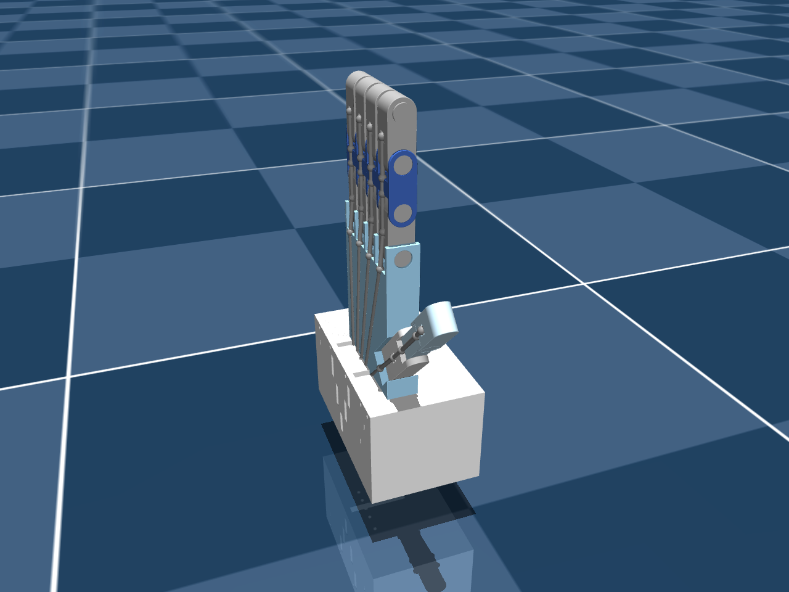


A raw CAD export gives you bodies, joints, meshes and sites — and a hand that does nothing. Four
edits and one extra file turn it into a tendon-driven twin. One of those edits, it turns out, does
nothing at all — which is worth understanding too.


## Which edits survive a re-export


flowchart TB
    subgraph generated["robot.xml — regenerated by onshape-to-robot"]
        D["① joint defaults<br>manual — re-apply"]
        T["② tendons + ③ contacts<br>auto-injected from tendons.xml"]
        B["bodies · joints · sites · meshes<br>generated"]
        A["④ actuators<br>manual — re-apply"]
    end
    S["⑤ scene.xml<br>floor · lights · skybox<br>never regenerated"] -->|"include robot.xml"| generated


| # | Edit | Lives in | Survives re-export? |
|---|---|---|---|
| ① | Joint friction / armature / damping defaults | `robot.xml` `<default>` | ✘ re-apply |
| ② | Flexor + extensor spatial tendons | `tendons.xml` → injected | ✔ |
| ③ | Contact exclusions | `tendons.xml` → injected | ✔ |
| ④ | Five tendon motors | `robot.xml` `<actuator>` | ✘ re-apply |
| ⑤ | Environment | `scene.xml` | ✔ separate file |

`tendons.xml` is kept byte-identical to the `<tendon>` and `<contact>` region of `robot.xml`. Tune a
tendon in `robot.xml` without copying it back and the next export silently reverts it.

## ① Joint defaults — stability

```xml
<default class="ros2-tendon-driven-hand-gazebo-digital-twin">
  <joint frictionloss="0.001" armature="0.0001" damping="0.01"/>
```

| Attribute | Value | Role |
|---|---|---|
| `damping` | 0.01 N·m·s/rad | stops a 2 g phalanx reaching absurd speed when 50 N yanks it |
| `armature` | 0.0001 kg·m² | rotor-like inertia on each joint's diagonal — conditions the solver for very light bodies |
| `frictionloss` | 0.001 N·m | a small dry-friction dead-band so joints settle instead of creeping |

Phalanges weigh **1.8–5.4 g**. Without these, tiny inertias under large tendon forces blow up the
integrator — an earlier, larger revision of the model logged
`Nan, Inf or huge value in QACC at DOF 128. The simulation is unstable.`


These defaults add **no stiffness** — and that is exactly why the finger acts as a switch
([Part 11](/projects/ros2-tendon-driven-hand-mujoco-digital-twin-vision-teleoperation/tendon-physics-switch/)).


## ② Tendons — a flexor and an extensor per finger

```xml
<spatial width="0.001" name="tendon_flex_index" stiffness="15" damping="0.05">
  <!-- <site site="horn_flex_index"/> -->
  <site site="palm_in_flex_index"/>
  <site site="palm_out_flex_index"/>
  <site site="proximal_flex_index"/>
  <site site="intermediate_in_flex_index"/>
  <site site="intermediate_out_flex_index"/>
  <site site="anchor_flex_index"/>
</spatial>
```

A **spatial tendon** is the shortest path through an ordered list of sites. Its length changes as the
bodies carrying those sites move, and a force along it becomes joint torque through the moment arm at
each site.


| Site | On body | Purpose |
|---|---|---|
| `palm_in`, `palm_out` | palm | entry and exit of the palm channel |
| `proximal` | proximal phalanx | moment arm for the MCP joint |
| `intermediate_in`, `intermediate_out` | intermediate phalanx | moment arm for the PIP joint |
| `anchor` | distal phalanx | termination — its pull bends the DIP |

| Attribute | Value | Meaning |
|---|---|---|
| `width` | 0.001 m | render thickness only — the 1 mm strings in the viewer |
| `stiffness` | 15 N/m | spring along the tendon, around its initial length |
| `damping` | 0.05 N·s/m | velocity damping along the tendon |



### The "horn hack"

The first site of every tendon — `horn_*`, on the servo horn — is **commented out**:

- **With it**, a tendon starts on a rotating horn: you'd need a position-controlled `servo_*` hinge and
  rotary-to-linear string kinematics.
- **Without it**, the tendon starts at the fixed palm entry, and a linear motor pulls it directly.

The control problem becomes *"pull this string with F newtons."* The price: the horns in the model are
decorative and spin freely. Restoring the horn sites with position servos is the path to a
hardware-faithful twin.

## ③ Contact exclusions — redundant, and why

```xml
<contact>
  <exclude body1="part_1" body2="servo_horn"/>
  <exclude body1="part_1" body2="servo_horn_2"/>
  <exclude body1="part_1" body2="servo_horn_3"/>
  <exclude body1="part_1" body2="servo_horn_4"/>
  <exclude body1="part_1" body2="servo_horn_5"/>
</contact>
```

These were added to stop the flush-mounted horns being blasted out of the palm by contact forces. In
the current model **they change nothing**, for two independent reasons:

1. **Parent–child filtering.** Every horn is a direct child of `part_1`, and MuJoCo skips parent–child
   contacts by default.
2. **The collision class can't self-collide.** The export's default is
   `<geom group="3" contype="1" conaffinity="0"/>`. Two geoms collide only if
   `(contype₁ & conaffinity₂) || (contype₂ & conaffinity₁)` — with `conaffinity=0` on both, never.

Verified directly: **0 contacts** at the open pose and at the full fist.


**Consequence:** fingers pass through each other and the palm. Harmless for a mirror twin — but to
simulate **grasping**, give the object `conaffinity="1"`, and give finger collision geoms
`conaffinity="1"` if they should collide with each other.


## ④ Tendon motors

```xml
<actuator>
  <motor class="ros2-tendon-driven-hand-gazebo-digital-twin" name="pull_pinky"  tendon="tendon_flex_pinky"  ctrlrange="-50 50"/>
  <motor class="ros2-tendon-driven-hand-gazebo-digital-twin" name="pull_ring"   tendon="tendon_flex_ring"   ctrlrange="-50 50"/>
  <motor class="ros2-tendon-driven-hand-gazebo-digital-twin" name="pull_middle" tendon="tendon_flex_middle" ctrlrange="-50 50"/>
  <motor class="ros2-tendon-driven-hand-gazebo-digital-twin" name="pull_index"  tendon="tendon_flex_index"  ctrlrange="-50 50"/>
  <motor class="ros2-tendon-driven-hand-gazebo-digital-twin" name="pull_thumb"  tendon="tendon_flex_thumb"  ctrlrange="-50 50"/>
</actuator>
```

A `<motor>` is a direct force actuator — force = gear × ctrl — along the tendon. Only flexors are
actuated; extensors are passive. **Names are the API**: the Python looks up `pull_{finger}`.

## ⑤ `scene.xml` — keep the world out of the generated file

```xml
<mujoco model="scene">
  <include file="robot.xml"/>
  <visual>
    <headlight diffuse="0.6 0.6 0.6" ambient="0.3 0.3 0.3" specular="0 0 0"/>
    <global azimuth="160" elevation="-20"/>
  </visual>
  <!-- skybox texture, checker ground material -->
  <worldbody>
    <light pos="0 0 3.5" dir="0 0 -1" directional="true"/>
    <geom name="floor" size="0 0 0.05" type="plane" material="groundplane"/>
  </worldbody>
</mujoco>
```

A re-export never touches lights or floor. Always load **`scene.xml`**.

## Re-export checklist


So the export is a reviewable diff.
Edits ② and ③ are injected from it.
`onshape-to-robot mujoco_twin/model`
Joint defaults in the default class; the `<actuator>` block, replacing generated servo actuators.
Load `scene.xml` and expect `ntendon=10`, `nu=5`; re-run `docs/tools/make_figures.py all`.
`docker compose restart mujoco_twin`

