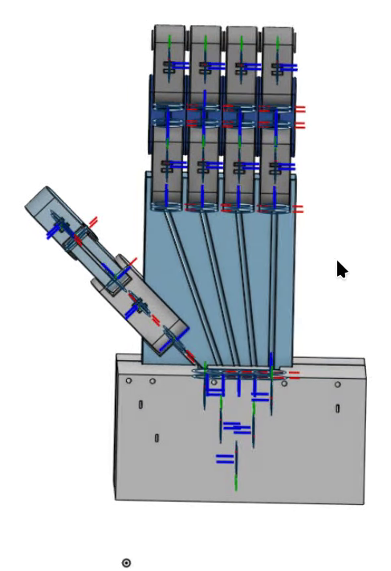
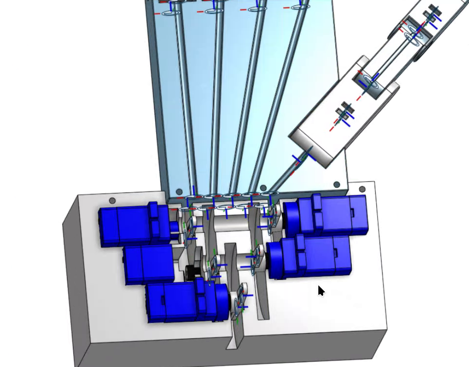
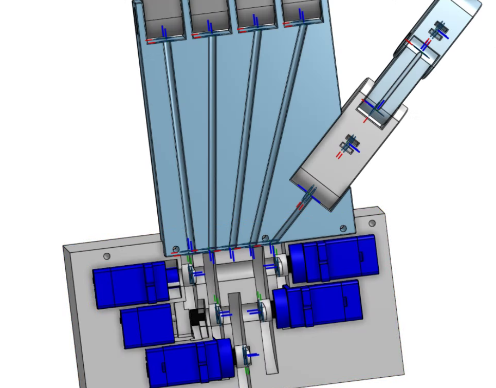
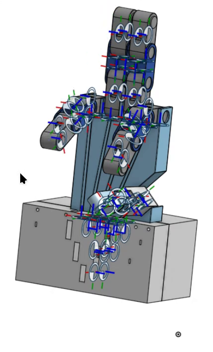
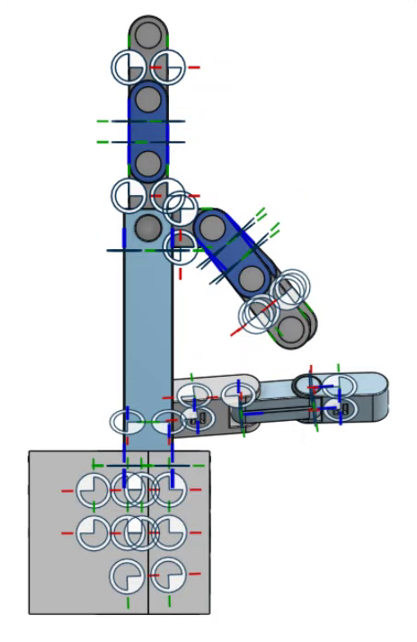
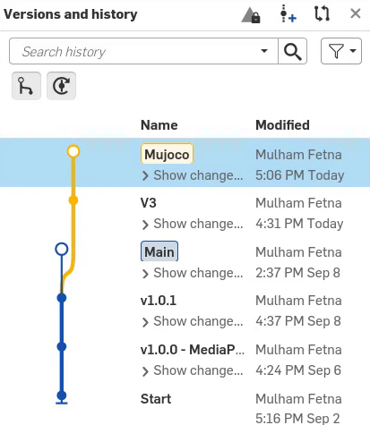
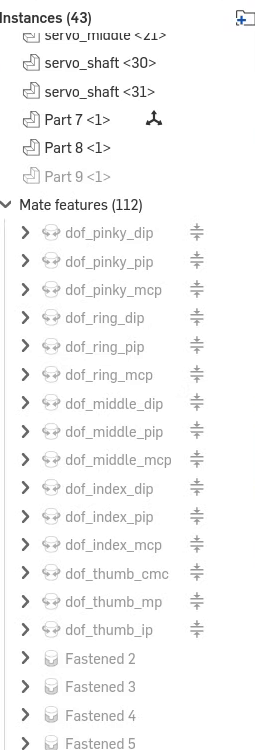
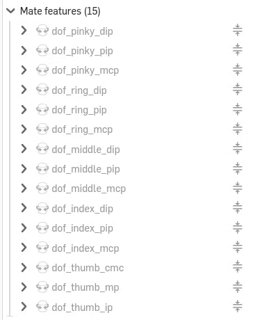


The simulated hand was never modelled by hand. It is an Onshape assembly — five SG90 servos, fifteen
knuckle mates, a palm full of tendon channels — pulled through the Onshape API and written out as
MuJoCo XML. Here is the design, and every setting that steers the export.


Open the Onshape assembly

## The design




  
  
  
  
  
  


- **Palm and fingers:** four three-phalanx fingers and a three-segment thumb, every knuckle a
  **revolute mate** with limits. The RGB triads in the views are mate connectors.
- **Tendon channels:** one per finger, running down the palm into the base.
- **Servo block:** five SG90-class servos, staggered so each horn sits under a tendon exit.

## The design has a history



The first version in the history.


The joint-angle-driven hand behind the [RViz predecessor project](/projects/ros2-mediapipe-robotic-hand-digital-twin-vision-teleoperation/).


Point release and the main line the later work branches from.


The current design used by this twin — the version with the servo base block shown above.



| Onshape version history | Mate features |
|---|---|
|  |  |

*43 part instances, 112 mate features: the 15 `dof_*` knuckle mates, the servo mates, and many `Fastened` mates.*

, before the servo base existed.")

## Mates become joints

onshape-to-robot turns each **mate** into a MuJoCo **joint** and keeps its **name**, stripping the
`dof_` prefix — `dof_index_pip` becomes joint `index_pip`. Naming in CAD is part of the software
interface.



The model ends up with 20 hinge joints: 15 knuckles and 5 servo horns, with limits taken from the mates.

## Running the export

```bash
pip install onshape-to-robot                        # any recent Python; separate env is fine

# Onshape API keys — create at https://dev-portal.onshape.com/keys, keep them in a git-ignored .env
export ONSHAPE_API=https://cad.onshape.com
export ONSHAPE_ACCESS_KEY=...
export ONSHAPE_SECRET_KEY=...

onshape-to-robot mujoco_twin/model                  # the directory holding config.json
```

It writes `robot.xml` plus `assets/*.stl` (and `.part` metadata) into that directory.


**The export overwrites `robot.xml`.** The joint defaults and the `<actuator>` block are manual edits
that must be re-applied ([Part 13](/projects/ros2-tendon-driven-hand-mujoco-digital-twin-vision-teleoperation/mjcf-edits/)).
Commit first, so `git diff` shows exactly what changed.


## `config.json`, field by field

```json
{
  "url": "https://cad.onshape.com/documents/a2dbb5f16624f10f1aa22f02/w/693ffc0be3e83ae21f78f6ed/e/4d69727744037003575f4068",
  "output_format": "mujoco",
  "clearance": 0.0,
  "ignoreLimits": false,
  "useMeshes": true,
  "mergeSTLs": "no",
  "additional_xml": "tendons.xml",
  "joint_properties": {
    "default": { "actuated": false },
    "servo_index":  { "actuated": true },
    "servo_middle": { "actuated": true },
    "servo_ring":   { "actuated": true },
    "servo_pinky":  { "actuated": true },
    "servo_thumb":  { "actuated": true }
  }
}
```

| Field | Value | What it does | Why it matters for a tendon hand |
|---|---|---|---|
| `url` | assembly URL | document / workspace / element to export | a `…/w/…` workspace URL exports the *current* state; use `…/v/…` for a frozen, reproducible export |
| `output_format` | `"mujoco"` | MJCF instead of the default URDF | MJCF can express tendons, sites and tendon actuators; URDF can't |
| `additional_xml` | `"tendons.xml"` | injects a file into the output | tendons and contacts survive every re-export (`robot.xml` carries `<!-- Additional tendons.xml -->`) |
| `clearance` | `0.0` | padding on collision geometry | 1:1 CAD tolerances — intersecting parts show up instead of hiding |
| `ignoreLimits` | `false` | keep mate limits as joint ranges | the 90° knuckle stops come from here, and the tendon physics depends on them |
| `useMeshes` | `true` | STL meshes for geoms | phalanges keep their real shape |
| `mergeSTLs` | `"no"` | one STL per part | per-part mass and inertia stay accurate for 1.8–5.4 g phalanges |

### `joint_properties`: keep the knuckles passive

By default the exporter actuates **every** joint — 20 motors, one inside each knuckle.
`"default": {"actuated": false}` makes the knuckles **passive**, so only tendons can move them —
which is what an underactuated hand is. The `servo_*` entries mark the horn joints as actuated, but in
the committed model those generated servo actuators are replaced by hand with five linear tendon
motors, and the horns spin freely.

## CAD rules that make exports work

- **Name mates as you want joints named.** Code and XML address joints and sites by name.
- **Set limits on every knuckle — and mind the sign.** The mate's axis direction is exported as-is,
  so some joints come out `[−90°, 0]` and others `[0, +90°]`. This model has both
  ([Part 14](/projects/ros2-tendon-driven-hand-mujoco-digital-twin-vision-teleoperation/model-anatomy/)).
- **Define the tendon via-points in CAD** as reference frames the exporter turns into `<site>`s,
  following its frame-naming convention ([documentation](https://onshape-to-robot.readthedocs.io/)).
  A renamed frame fails at load time with `Error: site '…' not found in wrap N`.
- **Avoid interpenetrating parts** at the export pose.
