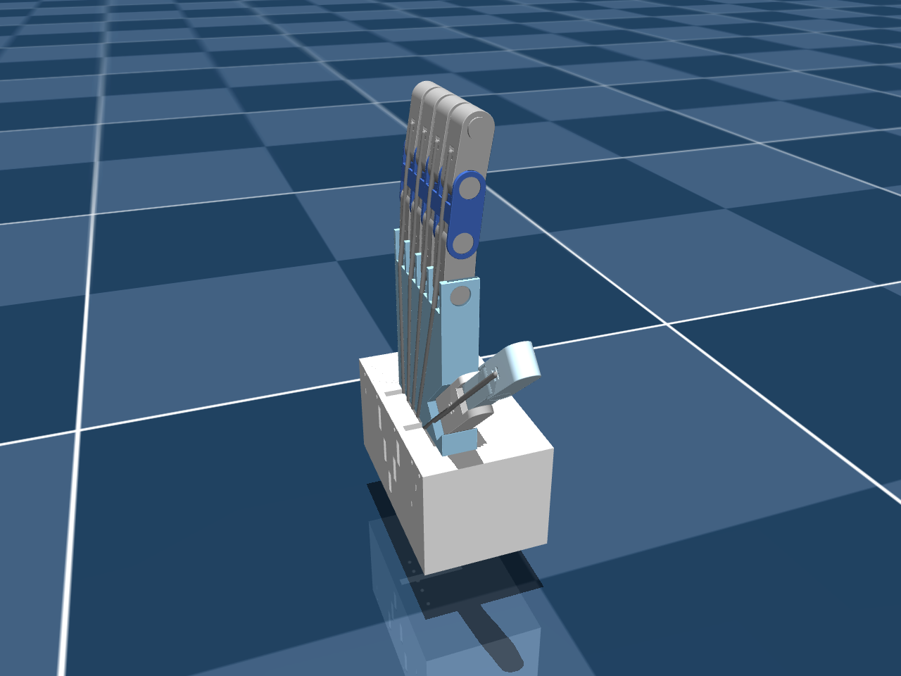
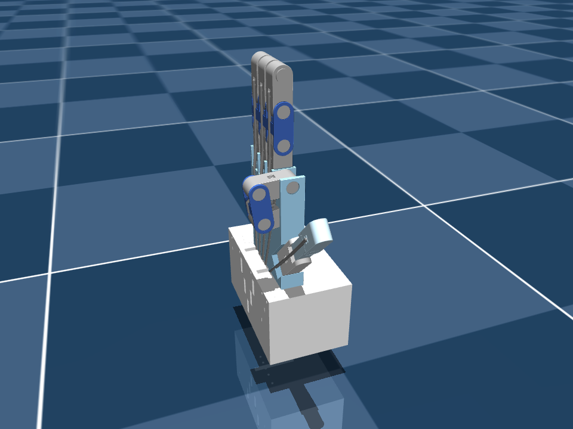


Clone, run one setup script, run one Compose command — and a webcam window and a MuJoCo viewer open
side by side, with a simulated hand that closes when you close yours. Here are four ways in,
from the full stack down to the bare model.



## What you need

| Requirement | Check with | Notes |
|---|---|---|
| Linux desktop, X11 or XWayland | `echo $DISPLAY` → `:0` | Wayland sessions work through XWayland |
| Docker Engine + Compose v2 | `docker compose version` | Built with Docker 29.8 / Compose 5.5 |
| A webcam | `ls /dev/video0` | Close any other app using it |
| GPU device nodes | `ls /dev/dri` | Intel/AMD out of the box; NVIDIA needs the container toolkit ([Part 18](/projects/ros2-tendon-driven-hand-mujoco-digital-twin-vision-teleoperation/docker-gui-camera-gpu/)) |
| ~5 GB of disk | | images: vision 2.9 GB, twin 1.7 GB |

No ROS installation is needed on the host — ROS 2 Jazzy lives inside the containers.

## Four ways to run it




```bash
git clone https://github.com/mulhamfetna/ros2-tendon-driven-hand-mujoco-digital-twin-vision-teleoperation.git
cd ros2-tendon-driven-hand-mujoco-digital-twin-vision-teleoperation

./setup_host.sh              # X11 access for the containers + camera/GPU checks (once per login)
docker compose up --build    # builds both images, starts vision_tracker and mujoco_twin
```

Stop with `Ctrl+C`, then `docker compose down` to release the camera.



No Docker, no ROS — the reference implementation in one process. Python **3.10** is the tested version.

```bash
python3.10 -m venv venv
source venv/bin/activate
pip install "mediapipe==0.10.11" "mujoco==3.13.0" opencv-python numpy
python standalone/main.py        # ESC in the camera window quits
```

If your shell sources ROS 2 (`/opt/ros/*/setup.bash`), its `PYTHONPATH` can shadow the venv — run
`env -u PYTHONPATH venv/bin/python standalone/main.py` instead.



Develop the simulation side without a webcam by publishing flexions by hand:

```bash
docker compose up mujoco_twin
# in a second terminal:
docker compose exec mujoco_twin bash -c 'source /opt/ros/jazzy/setup.bash && \
  ros2 topic pub -r 10 /hand/target_flexions sensor_msgs/msg/JointState \
  "{name: [thumb, index, middle, ring, pinky], position: [0.0, 1.0, 0.0, 0.0, 0.0]}"'
```

Only the index finger curls.



Explore the model interactively — no ROS, no camera:

```bash
env -u PYTHONPATH venv/bin/python -m mujoco.viewer --mjcf=mujoco_twin/model/scene.xml
```

Open the **Control** panel and drag a `pull_*` slider. Notice how little force it takes to close a
finger completely — [Part 11](/projects/ros2-tendon-driven-hand-mujoco-digital-twin-vision-teleoperation/tendon-physics-switch/) explains why.




## What success looks like

With the full stack, in order:

1. `setup_host.sh` prints `[Camera] /dev/video0 found.` and `[GPU] /dev/dri found.`
2. The build ends with `Image …-vision_tracker Built` and `Image …-mujoco_twin Built` (about five
   minutes the first time; seconds afterwards).
3. Two windows open: **"MediaPipe Hand Tracker"** and the **MuJoCo viewer**.
4. The log prints `MuJoCo twin listening on /hand/target_flexions`.
5. Make a fist — the twin closes. Open your hand — it opens.

```text
$ docker compose up --build
 Container mujoco_twin Started
 Container vision_tracker Started
mujoco_twin     | [INFO] [1789562507.994533012] [mujoco_twin_node]: MuJoCo twin listening on /hand/target_flexions
vision_tracker  | QFontDatabase: Cannot find font directory /opt/venv/lib/python3.12/site-packages/cv2/qt/fonts.
```

The `QFontDatabase` line is harmless noise from OpenCV's bundled Qt.

| The twin, open | The twin, fist | Camera-free: index only |
|---|---|---|
|  |  |  |

## Edit, restart, repeat

The repository is **bind-mounted** into both containers rather than copied into the images. After
editing any Python file or MuJoCo XML:

```bash
docker compose restart mujoco_twin      # or vision_tracker
```

Rebuild (`docker compose up --build`) only when a Dockerfile or a pinned dependency changes.
[Part 16](/projects/ros2-tendon-driven-hand-mujoco-digital-twin-vision-teleoperation/docker-compose-architecture/)
explains the layout.


Windows don't open, the camera won't start, or the twin ignores your hand? Every error met while
building this is in [Part 3 — Troubleshooting and FAQ](/projects/ros2-tendon-driven-hand-mujoco-digital-twin-vision-teleoperation/troubleshooting-faq/).


## Where to go next

- The whole system on one page → [Part 2: Architecture](/projects/ros2-tendon-driven-hand-mujoco-digital-twin-vision-teleoperation/architecture/)
- Make it track *your* hand well → [Part 9: Calibration](/projects/ros2-tendon-driven-hand-mujoco-digital-twin-vision-teleoperation/calibration/)
- Full-resolution demo video → [project page](/projects/ros2-tendon-driven-hand-mujoco-digital-twin-vision-teleoperation/#watch-it)
