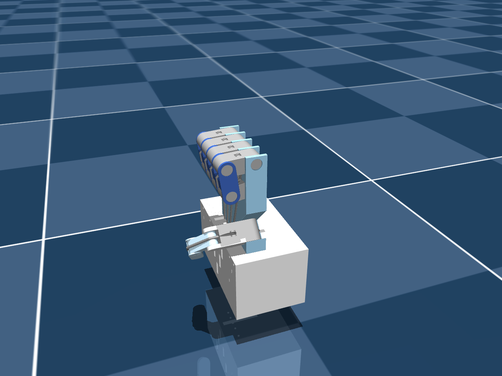
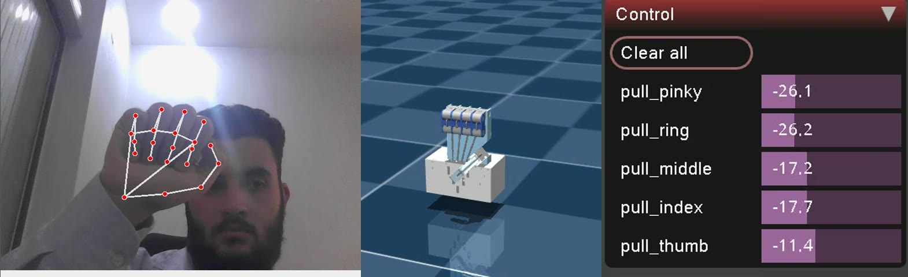


The system works, and it teaches well. Getting it to drive real servos safely is a sequence of
well-scoped upgrades — each one grounded in a limitation measured earlier in this series.


## Where it stands

| Area | Today | Production target |
|---|---|---|
| Hand tracking | image-normalized landmarks, one global calibration | metric world landmarks, per-finger calibration, a temporal filter |
| Command mapping | flexion → ±50 N; the twin is a switch | flexion → tendon length; proportional curl |
| Physics model | force motors, decorative horns, no self-contact | position servos on horns, tuned stiffness, contacts for grasping |
| Middleware | one topic, default QoS, open on the LAN | parameters, explicit QoS, a watchdog, SROS 2 |
| Containers | privileged, host namespaces, root, `xhost` | least privilege, non-root, optional headless |
| Code | classes copied into three files, no tests | one shared package, tests, CI |
| Hardware | simulation only | a servo driver on the same topic |




**World landmarks.** Image-normalized coordinates bend angles by up to 16° with hand orientation
([Part 4](/projects/ros2-tendon-driven-hand-mujoco-digital-twin-vision-teleoperation/mediapipe-hands/)).
Read `multi_hand_world_landmarks` instead, then recalibrate.

**Tendon-length position control.** Force control with zero stiffness closes a finger at −1 N
([Part 11](/projects/ros2-tendon-driven-hand-mujoco-digital-twin-vision-teleoperation/tendon-physics-switch/)).
Position actuators on tendon length gave 30° → 58° → 81° → 90° at 25/50/75/100% (`kp=1000`) — and it is
the command a servo needs. Tracked in [issue #1](https://github.com/mulhamfetna/ros2-tendon-driven-hand-mujoco-digital-twin-vision-teleoperation/issues/1).

**Off the legacy MediaPipe API.** `mp.solutions` blocks upgrades; the Tasks API `HandLandmarker`
returns the same landmarks and world landmarks.



**Filtering** — a One-Euro filter per finger: smooth when still, responsive when moving; most needed on
the thumb's narrow window.
**Decide what "no hand" means** — today it opens the hand, which drops a held object. Hold the last value
for N frames, then open.
**Watchdog** — the twin holds its last command forever if the publisher dies; ramp to a safe pose after
~250 ms without messages.
**Parameters, not constants** — calibration, limits, topic and rates in a mounted ROS 2 YAML file.
**Explicit QoS** — for control, the newest sample matters most: keep-last 1 on both ends.
**Validate at startup** — assert every `mj_name2id` ≥ 0 and that `ctrlrange` matches the code.



**One package.** `HandTracker` and `DigitalTwin` live in three files, and the calibration has already
drifted once. Extract a small package mounted into both containers and imported by the standalone script.
**Tests with no camera or display** — angle maths and NaN guards, normalization and lerp, model
loads with 10 tendons and 5 actuators, a steady-state sweep as a regression test, and a `rosbag`
replayed into a headless twin (`MUJOCO_GL=egl`).
**CI** — run them in the same `ros:jazzy` images on every push, and regenerate the doc figures when
the model changes.



Measure each finger's real tendon stroke (the simulated index needs 42 mm), map flexion → horn angle
with hard per-finger limits, rate-limit the command, and bridge through a PCA9685 PWM board or a
micro-ROS microcontroller. Then publish feedback — servo current or a potentiometer — so the twin can
mirror the *real* hand, not just the command.



Drop `privileged`, run non-root with scoped X11 auth or headless; narrow `ipc`/`pid` sharing; choose
`LOCALHOST` or **SROS 2** so nobody on the LAN can move real hardware; pin base-image digests; and resolve
the viewer/MediaPipe GPU contention ([Part 19](/projects/ros2-tendon-driven-hand-mujoco-digital-twin-vision-teleoperation/latency-benchmark/)).




## The hardware step, drawn

The topic contract was designed for exactly this: vision and simulation don't change at all.


flowchart LR
    V["🐳 vision_tracker"] -- "/hand/target_flexions" --> T["🐳 mujoco_twin simulation"]
    V -- "/hand/target_flexions" --> H["🆕 servo_driver flexion → horn angle → PWM"]
    H --> S["5 × SG90 servos PCA9685 or micro-ROS"]
    S -. "current · position feedback" .-> T


| The design already has the servos… | …and the twin already has the fist |
|---|---|
|  |  |


**Before anything moves a real string:** SG90s stall and overheat against a taut tendon. Enforce
per-finger angle limits in the driver, rate-limit, and fail safe on a stale topic — Stage 2's watchdog is
not optional once hardware is attached.


## The one-line summary

Correctness first (measure in metres, command in millimetres of string), then robustness, then one
tested codebase — and only then real servos, behind a watchdog and an authenticated topic.
