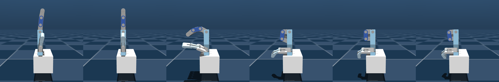
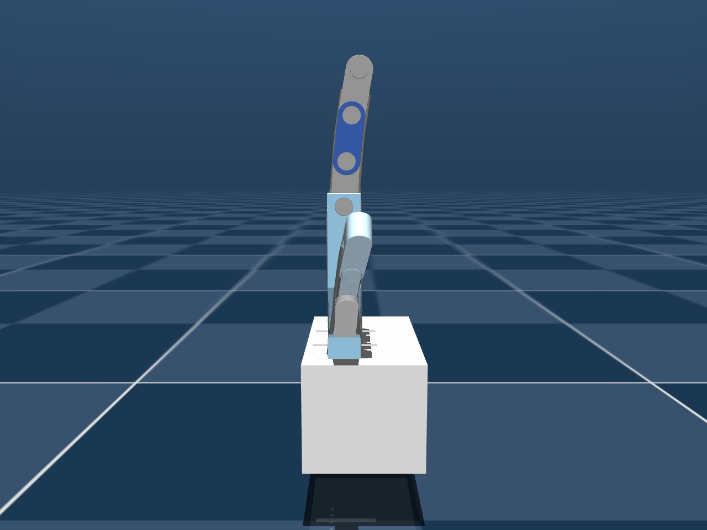
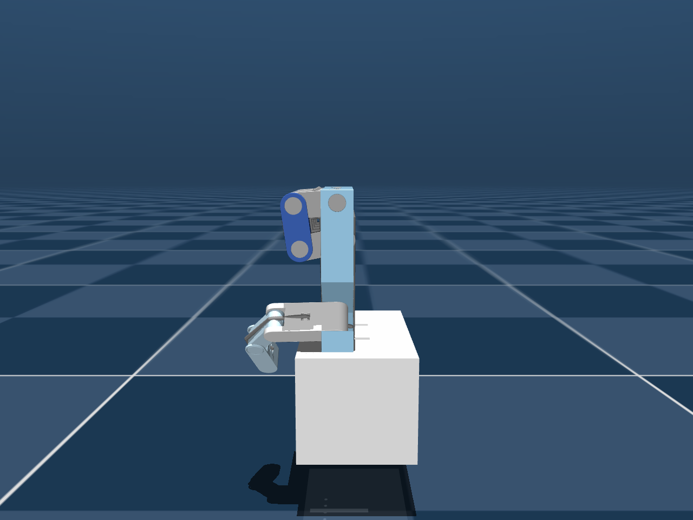




The vision layer sends a carefully normalized, smooth 0-to-1 signal. The simulated finger turns it
into two states: open and closed. This is the most important thing to understand about the twin —
and every number below was measured on the model in the repository.


## The measurement

The same flexion was applied to all five motors, the model simulated for 3 s from rest, and the
steady-state joint angles recorded — 41 flexion values from 0 to 1.


type: 'line',
data: {
  labels: ['0.000','0.025','0.050','0.075','0.100','0.125','0.150','0.175','0.200','0.225','0.250','0.275','0.300','0.325','0.350','0.375','0.400','0.425','0.450','0.475','0.500','0.525','0.550','0.575','0.600','0.625','0.650','0.675','0.700','0.725','0.750','0.775','0.800','0.825','0.850','0.875','0.900','0.925','0.950','0.975','1.000'],
  datasets: [
    { label: 'Index finger (mean of MCP, PIP, DIP)', data: [-3.3,-3.1,-2.9,-2.8,-2.6,-2.5,-2.3,-2.1,-2.0,-1.8,-1.7,-1.5,-1.3,-1.2,-1.0,-0.8,-0.7,-0.5,-0.3,-0.2,0.0,90.2,90.4,90.6,90.8,91.0,91.2,91.5,91.7,91.9,92.1,92.2,92.4,92.6,92.8,93.0,93.2,93.4,93.5,93.7,93.9], borderColor: '#2a78d6', backgroundColor: '#2a78d6', borderWidth: 2, pointRadius: 1.5, tension: 0 },
    { label: 'Thumb CMC', data: [-2.9,-2.8,-2.6,-2.5,-2.4,-2.2,-2.1,-1.9,-1.8,-1.6,-1.5,-1.4,-1.2,-1.1,-0.9,-0.8,-0.6,-0.5,-0.3,-0.1,0.0,90.1,90.2,90.4,90.5,90.6,90.7,90.8,91.0,91.1,91.2,91.3,91.4,91.5,91.6,91.7,91.8,92.0,92.1,92.2,92.3], borderColor: '#1baf7a', backgroundColor: '#1baf7a', borderWidth: 2, pointRadius: 1.5, tension: 0 },
    { label: 'Thumb IP', data: [-2.7,-2.6,-2.5,-2.3,-2.2,-2.0,-1.9,-1.8,-1.6,-1.5,-1.4,-1.2,-1.1,-0.9,-0.8,-0.7,-0.5,-0.4,-0.3,-0.1,0.0,41.2,44.3,45.1,45.5,45.6,45.7,45.8,45.8,45.9,45.9,45.9,45.9,45.9,45.9,46.0,46.0,46.0,46.0,46.0,46.0], borderColor: '#eb6834', backgroundColor: '#eb6834', borderWidth: 2, pointRadius: 1.5, tension: 0 }
  ]
},
options: {
  plugins: { title: { display: true, text: 'Simulated joint bend vs flexion — flat, then a wall at 0.5' } },
  scales: { x: { title: { display: true, text: 'flexion command (0.5 = 0 N)' } }, y: { min: -10, max: 100, title: { display: true, text: 'joint bend (°)' } } }
}


| Flexion | Force | Index MCP / PIP / DIP | Thumb CMC / MP / IP |
|---|---|---|---|
| 0.000 | +50.0 N | −3.3° / −3.2° / −3.3° | −2.9° / −2.7° / −2.7° |
| 0.250 | +25.0 N | −1.7° / −1.6° / −1.7° | −1.5° / −1.3° / −1.4° |
| 0.500 | 0.0 N | 0.0° / 0.0° / 0.0° | 0.0° / 0.0° / 0.0° |
| 0.625 | −12.5 N | 91.1° / 91.0° / 91.0° | 90.6° / 53.9° / 45.6° |
| 1.000 | −50.0 N | 94.0° / 93.8° / 93.9° | 92.3° / 54.2° / 46.0° |

*Joint limits are 90°; values just above it are MuJoCo's soft limit being pressed.*

Zooming into the wall (index MCP, steady state from rest):

| Tendon force | 0 N | −0.1 N | −0.5 N | **−1.0 N** | −2.5 N |
|---|---|---|---|---|---|
| Index MCP bend | 0.0° | 1.0° | 62.1° | **90.1°** | 90.2° |

**The finger's entire proportional range fits between 0 and −1 N** — 1% of the ±50 N command range,
a flexion band of 0.50 to 0.51.



| Open (+50 N) | Closed (−50 N) |
|---|---|
|  |  |

## Timing and hysteresis

| Test | Result |
|---|---|
| Close from open at −50 N (MCP reaches 85°) | **48 ms** |
| Re-open from closed at +50 N (MCP below 10°) | **44 ms** |
| From closed, command 0 N for 2 s | still **69.6°** — barely drifts |
| From closed, command +1 N for 2 s | fully open (−0.1°) |

A finger does not return to open at flexion 0.5; it opens only once the command crosses to the push
side. Around 0.5 the finger simply stays where it last was.

## Why: nothing pushes back

A proportional position needs a restoring force that grows with displacement — a spring. At
equilibrium, per joint:

$$\underbrace{r\,F_\text{tendon}}_{\text{tendon torque}} \;=\; \underbrace{k_\text{joint}\,q}_{\text{joint spring}} \;+\; \underbrace{\tau_\text{springs}}_{\text{elastic tendons}} \;+\; \text{friction} + \text{gravity}$$

| Restoring element | In `robot.xml` | Contribution |
|---|---|---|
| Joint stiffness \(k_\text{joint}\) | **0** — not set | none |
| Joint damping | 0.01 | slows motion; no equilibrium force |
| Joint friction loss | 0.001 | a tiny dead-band |
| Tendon stiffness (flexor + extensor) | 15 N/m | a full curl stretches the extensor ~12 mm → **≈ 0.2 N** |
| Gravity on phalanges | a few grams each | tiny, orientation-dependent |

Nothing grows fast enough to balance even 1 N of pull, so any net pull accelerates the finger into its
**joint limit**, and the limit becomes the equilibrium. *Force control against a near-zero spring is a
switch.*

The thumb's MP and IP joints stopping near 54° and 46° even at −50 N hasn't been isolated; the likely
explanation is the thumb tendon's via-point geometry once the CMC hits its stop.

## Is the project wrong, then?

No — it's a **binary grasp twin**, which is exactly how the live demo looks: a crisp open ↔ fist
mirror. The fingers travel in ~45 ms, faster than one vision frame, so it looks instantaneous. The
smooth flexion signal isn't wasted either; it's on ROS 2 for any consumer. But partial poses can't be
mirrored, and calibration mostly moves *when* the switch flips.

## Three fixes, tested

Every option below stayed numerically stable over a 3 s settle. Numbers are index MCP / PIP / DIP bend.




Keep force control; give each finger joint a return spring (`jnt_stiffness` on the 15 finger joints):

| Stiffness (N·m/rad) | −5 N | −12.5 N | −25 N | −50 N |
|---|---|---|---|---|
| 0 — current | 90 / 90 / 90 | 91 / 91 / 91 | 92 / 92 / 92 | 94 / 94 / 94 |
| 0.03 | 86 / 75 / 75 | 91 / 90 / 90 | 92 / 91 / 92 | 94 / 93 / 93 |
| **0.1** | **24 / 21 / 20** | **72 / 62 / 62** | 91 / 90 / 90 | 92 / 92 / 92 |

At 0.1 the finger is proportional over the first ~25 N of pull (flexion 0.5 → 0.75); go stiffer
(start near 0.2) to spread the curl across the full half.

```xml
<!-- default class of robot.xml — finger joints, not the servo_* hinges -->
<joint frictionloss="0.001" armature="0.0001" damping="0.01" stiffness="0.1"/>
```

Force control still only curls on the *pull* half. To map all of 0 → 1 onto curl, set `FORCE_OPEN = 0`
and let the springs open the hand.



Raise `stiffness` on the passive `tendon_ext_*` tendons (currently 15 N/m) so the extensor becomes the
return spring — the rubber-band approach many 3D-printed hands use. Same principle as option A, applied
along the tendon path rather than per joint.

*Untested here — sweep it the same way before relying on it.*



Real SG90 servos are **position** devices: a horn angle winds the string to a length. Model that
directly — a position actuator on each flexor tendon — and interpolate flexion onto **length**. From
the model, the index flexor is **0.1294 m open** and **0.0870 m closed**.

| Gain | t = 0.25 | t = 0.5 | t = 0.75 | t = 1.0 |
|---|---|---|---|---|
| kp = 200 | 33 / 22 / 18 | 61 / 43 / 36 | 85 / 61 / 55 | 90 / 85 / 82 |
| **kp = 1000** | **30 / 24 / 22** | **58 / 46 / 42** | **81 / 65 / 63** | **90 / 90 / 90** |

*kv = 2·√(kp·0.001): ≈ 0.9 for kp 200, 2 for kp 1000.*

```xml
<position name="pull_index" tendon="tendon_flex_index" kp="1000" kv="2" ctrlrange="0.0870 0.1294"/>
```

```python
target_length = L_open[finger] + flexion * (L_closed[finger] - L_open[finger])
self.data.ctrl[self.motors[finger]] = target_length
```

A smooth, monotonic curl over the **whole** range — and the same command a hardware servo driver needs.





type: 'line',
data: {
  labels: ['0', '0.25', '0.5', '0.75', '1.0'],
  datasets: [
    { label: 'Force control today (index MCP)', data: [-3.3, -1.7, 0.0, 92.1, 94.0], borderColor: '#eb6834', backgroundColor: '#eb6834', borderWidth: 2, tension: 0 },
    { label: 'Tendon-length control, kp=1000 (index MCP)', data: [0, 30, 58, 81, 90], borderColor: '#2a78d6', backgroundColor: '#2a78d6', borderWidth: 2, tension: 0 }
  ]
},
options: {
  plugins: { title: { display: true, text: 'Index MCP bend: switch vs proportional' } },
  scales: { x: { title: { display: true, text: 'flexion command' } }, y: { min: -10, max: 100, title: { display: true, text: 'bend (°)' } } }
}


Option C is tracked for implementation in
[issue #1](https://github.com/mulhamfetna/ros2-tendon-driven-hand-mujoco-digital-twin-vision-teleoperation/issues/1).

## Reproduce it

```bash
env -u PYTHONPATH MUJOCO_GL=glfw venv/bin/python docs/tools/make_figures.py all
```

It rewrites `docs/data/flexion_sweep.json` and regenerates every chart and render from the model and
the constants in `standalone/main.py`.
