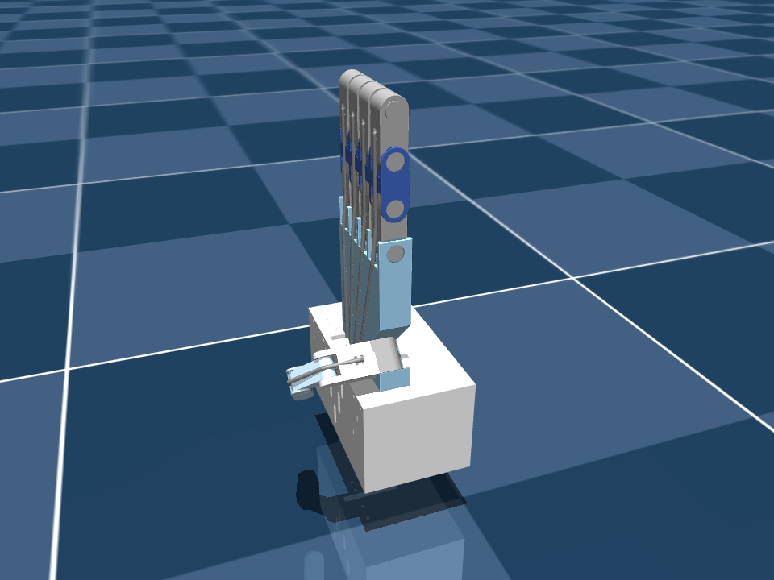




Squeeze your thumb across your palm as hard as you can and, by the finger thresholds, it is only
half closed. The thumb isn't a finger with a shorter bone — it's a different joint.


; every other motor pushes open.")

## Hinges versus a saddle

- **Index to pinky** are chains of **hinge joints**. A fist rolls them into a tight spiral, each
  knuckle approaching 90°.
- **The thumb** hangs from the **carpometacarpal (CMC) saddle joint** at the wrist. It *sweeps*
  across the palm — opposition — instead of simply curling. Much of "closing the thumb" is rotation
  of the whole thumb, not bending at its knuckles.

## What MediaPipe measures because of it

Interior angles come from 3D landmark positions, so the sweep only partly shows up as knuckle bend:

| | Open | Fully closed | Travel |
|---|---|---|---|
| Finger — mean of MCP/PIP/DIP | ≈ 3.10 rad | ≈ 1.60 rad | 1.50 rad |
| Thumb — mean of CMC/MCP/IP | ≈ 2.90 rad | ≈ 2.30 rad | **0.60 rad** |

A fully closed thumb stops near **2.30 rad (~132°)**. Even its *open* angle sits below a finger's —
a relaxed thumb is never in line with the wrist.

## The failure the separate window fixes

With the finger window, a thumb squeezed as far as it goes gives:

$$\text{flexion} = \frac{3.10 - 2.30}{1.50} = 0.53 \quad\Rightarrow\quad F = 50 - 100 \times 0.53 \approx -3\ \text{N}$$

Fully closed thumb, half-closed command. With its own window:

$$\text{flexion} = \frac{2.90 - 2.30}{0.60} = 1.0 \quad\Rightarrow\quad F = -50\ \text{N}$$

```python
if finger_name == "thumb":
    straight_limit = THUMB_STRAIGHT_ANGLE   # 2.90
    curled_limit = THUMB_CURLED_ANGLE       # 2.30
else:
    straight_limit = RAW_STRAIGHT_ANGLE     # 3.10
    curled_limit = RAW_CURLED_ANGLE         # 1.60
```

## The trade-off: a narrow window is a twitchy window

The thumb covers 0 → 1 in 0.60 rad, so it is **2.5× more sensitive** than the fingers
(\(1.50 / 0.60\)). Landmark jitter that barely moves a finger visibly moves the thumb. If the thumb
flickers:

- widen its window slightly (e.g. 2.95 → 2.25), or
- add temporal filtering — a One-Euro filter is on the
  [production roadmap](/projects/ros2-tendon-driven-hand-mujoco-digital-twin-vision-teleoperation/roadmap-to-production/).

## The robot thumb closes differently too

On the simulation side, the thumb doesn't close like a finger either. At the full −50 N pull its CMC
joint reaches ~92° but its MP and IP joints stop around 54° and 46°, while every index joint reaches ~94°.


type: 'bar',
data: {
  labels: ['MCP / CMC', 'PIP / MP', 'DIP / IP'],
  datasets: [
    { label: 'Index finger', data: [94.0, 93.8, 93.9], backgroundColor: 'rgba(42, 120, 214, 0.75)' },
    { label: 'Thumb', data: [92.3, 54.2, 46.0], backgroundColor: 'rgba(235, 104, 52, 0.75)' }
  ]
},
options: {
  plugins: { title: { display: true, text: 'Simulated joint bend at full flexion (−50 N)' } },
  scales: { y: { min: 0, max: 100, title: { display: true, text: 'joint bend (°)' } } }
}




The likely cause is the thumb tendon's routing geometry — once the CMC hits its stop, the path leaves
little moment arm to curl the distal joints further — but it hasn't been isolated yet. The vision
thresholds and the robot's joint distribution are independent problems;
[Part 11](/projects/ros2-tendon-driven-hand-mujoco-digital-twin-vision-teleoperation/tendon-physics-switch/) covers the physics.
