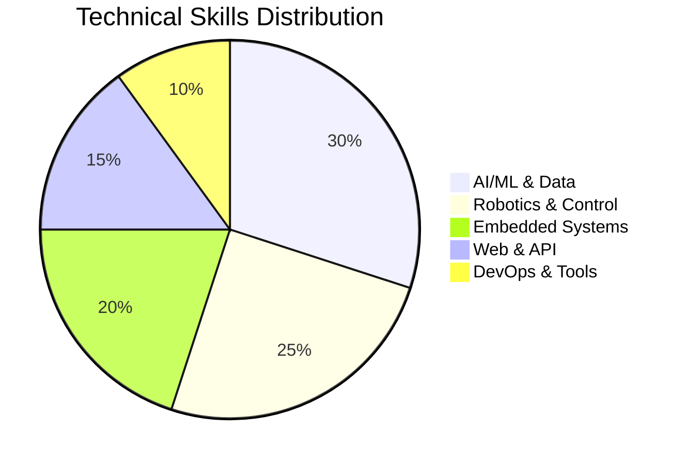

# Technical Skills & Expertise

> Comprehensive overview of technical competencies across AI/ML, embedded systems, robotics, and software development.

---

## Programming Languages

| Language | Proficiency | Primary Use |
|----------|-------------|--------------|
| **Python** | Advanced | AI/ML, Data Engineering, Automation, Web |
| **C++** | Advanced | Embedded Systems, OpenCV, Performance-critical |
| **C** | Intermediate | Microcontroller Programming |
| **C#** | Intermediate | Windows Development |
| **Shell/Bash** | Intermediate | Automation, System Administration |

---

## AI & Machine Learning

| Skill | Description | Tools/Frameworks |
|-------|-------------|------------------|
| **Deep Learning** | Neural network development | PyTorch, TensorFlow |
| **Computer Vision** | Image processing, object detection | OpenCV, YOLO, Ultralytics |
| **Edge AI** | Real-time inference on devices | Raspberry Pi, TensorFlow Lite |
| **RAG Pipelines** | Retrieval Augmented Generation | LangChain, Ollama, LLaMA |
| **MLOps** | ML operations & deployment | Docker, MLflow, CI/CD |
| **Arabic NLP** | Arabic text processing | AraBERT, pyarabic, CAMeL Tools |
| **Model Training** | Custom model fine-tuning | PyTorch, TensorFlow |
| **Local AI** | On-premise LLM deployment | Ollama, LLaMA, FastAPI |

---

## Robotics & Control Systems

| Skill | Description | Application |
|-------|-------------|-------------|
| **ROS/ROS2** | Robot Operating System | Robotics frameworks, Gazebo |
| **Model Predictive Control** | MPC for UAVs | Multi-UAV formation |
| **Geometric Control** | SO(3) attitude control | Quaternion-based |
| **Inverse Kinematics** | Hybrid ensemble IK | Robotic manipulation |
| **Path Planning** | Swarm algorithms | Dynamic environments |
| **State Estimation** | EKF/UKF | Localization |
| **RTOS** | Real-time operating systems | Embedded |
| **Control Theory** | PID, LQR, Optimal | Control systems |

---

## Embedded Systems & Hardware

| Skill | Description | Tools |
|-------|-------------|-------|
| **Microcontrollers** | ATmega, STM32, ESP32 | Arduino, PlatformIO |
| **PCB Design** | Circuit design | KiCad, EasyEDA, Proteus |
| **Firmware Development** | Embedded programming | C, C++ |
| **Sensors** | IR, ultrasonic, IMU | I2C, SPI, UART |
| **Motors** | Brushed, brushless, stepper, servo | PWM control |
| **Communication** | I2C, SPI, UART, CAN, Bluetooth, WiFi | Embedded protocols |

---

## Data Engineering

| Skill | Description | Tools |
|-------|-------------|-------|
| **Data Analysis** | Data manipulation | Pandas, NumPy |
| **Visualization** | Charts and dashboards | Plotly, Dash, Streamlit |
| **Parallel Computing** | Large-scale processing | Dask |
| **Caching** | Data caching | Redis |
| **Databases** | SQL & NoSQL | SQLite, MongoDB |
| **Time-Series** | Financial data analysis | Python, NumPy |

---

## DevOps & Infrastructure

| Skill | Description | Tools |
|-------|-------------|-------|
| **Containerization** | App packaging | Docker, Docker Compose |
| **Automation** | Workflow automation | N8N |
| **Secure Access** | Remote access | Twingate, Cloudflare Tunnel |
| **Linux** | System administration | Ubuntu, Arch |
| **Version Control** | Code management | Git, GitHub, GitLab |
| **CI/CD** | Continuous integration | GitHub Actions |

---

## Web & API Development

| Skill | Description | Tools |
|-------|-------------|-------|
| **REST APIs** | API development | FastAPI, Flask |
| **Web Scraping** | Data extraction | BeautifulSoup, Selenium |
| **MCP Servers** | Model Context Protocol | Custom implementations |
| **API Integration** | Third-party APIs | OpenAI, Google, Anthropic |

---

## Documentation & Tools

| Skill | Description | Tools |
|-------|-------------|-------|
| **Academic Writing** | Research papers | LaTeX |
| **Technical Docs** | Documentation | Markdown, Mermaid |
| **Diagrams** | Visual documentation | Mermaid, diagrams.net |

---

## Mathematics & Statistics

| Skill | Description |
|-------|-------------|
| **Probability Theory** | Advanced |
| **Statistics** | Advanced |
| **Linear Algebra** | Matrices, transformations |
| **Time-Series Analysis** | Financial data |
| **Quaternion Representations** | Robotics |
| **Optimization** | Metaheuristics |

---

## Languages

| Language | Proficiency |
|----------|-------------|
| **Arabic** | Native |
| **English** | Fluent |

---

## Skill Levels Summary

---

## Certifications

| Certification | Issuer |
|---------------|--------|
| CS50 Certified Instructor | Harvard University |
| McKinsey Forward Program | McKinsey & Company |
| Practical Electronics Diploma | Analog & Digital Design |
| AWS AI & ML Scholarship | AWS |
| Google 2025 AI Intensive Course | Google |
| PMP Preparation | Professional |
| MEAL Methodology | Professional |
| Cornell Take The Lead | Cornell University |
| Harvard Aspire Leaders | Harvard Business School |

---

## Tools & Technologies Used

### Development Environments
- VS Code
- Jupyter Notebook
- Google Colab
- Kaggle

### Cloud Platforms
- AWS
- Google Cloud

### Version Control
- GitHub
- GitLab

### Testing
- pytest
- Custom test frameworks