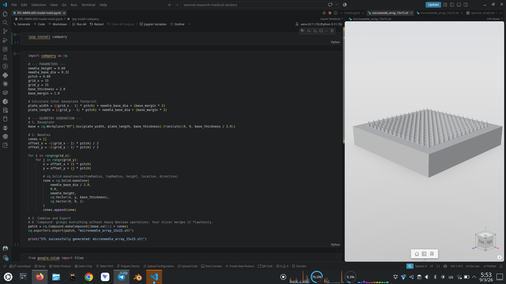
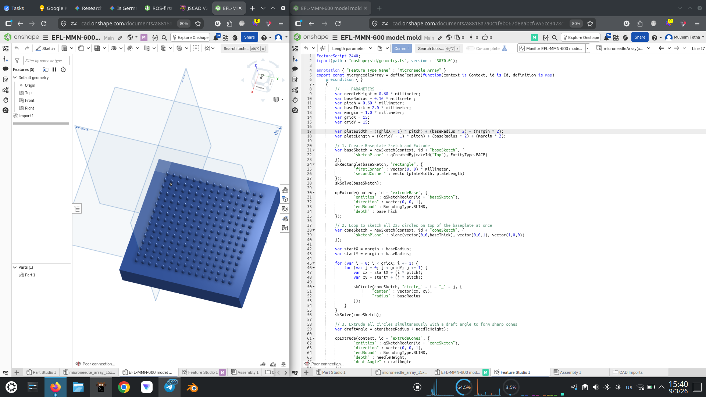
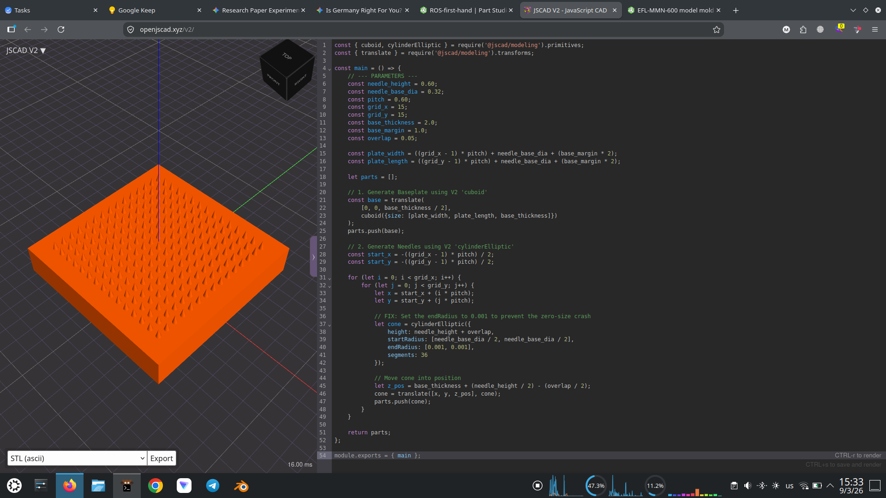
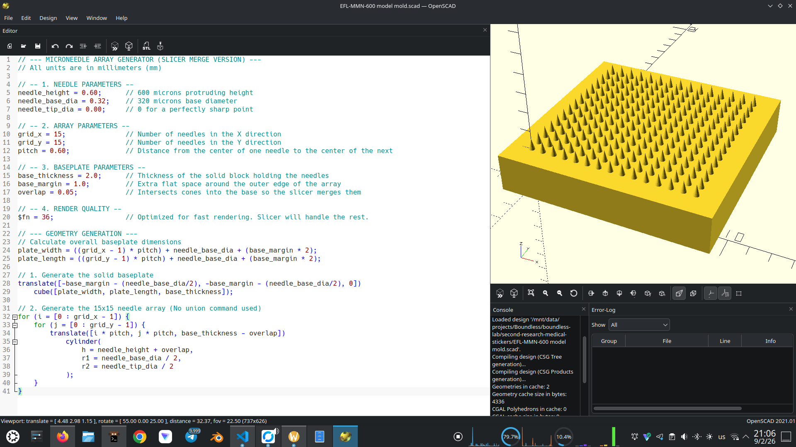

# Code-to-CAD: Generating a 15×15 Microneedle Array Four Ways

*Programming is a lifestyle, not a job title.* Once you have spent enough time writing loops, the
moment you find yourself clicking the same button 225 times in a CAD program, something in you
revolts. This article is what happened when that revolt met a real biomedical part.

**Quick answer: what is programmatic CAD?**
Programmatic CAD (Code-to-CAD) is the practice of generating 3D mechanical models from source code
rather than from a graphical user interface. By expressing geometry as scripts — Python
(CadQuery), JavaScript (OpenJSCAD), or a domain-specific language (OpenSCAD, FeatureScript) —
you get parametric, version-controlled, reproducible models, and you skip the manual repetition
that GUI modelling forces on you.

## The part

The geometry below comes from a **dissolving microneedle array patch (DMAP)**: a 15 × 15 grid of
sharp cones standing on a solid baseplate, printed as a mould master. All four scripts in this
article build the *identical* part from the *identical* parameters:

| Parameter | Value |
| --- | --- |
| Needle height | 0.60 mm (600 µm) |
| Needle base diameter | 0.32 mm (320 µm) |
| Needle tip diameter | 0 — a true sharp point |
| Grid | 15 × 15 = **225 needles** |
| Pitch (centre-to-centre) | 0.60 mm |
| Baseplate thickness | 2.0 mm |
| Margin around the array | 1.0 mm |
| Resulting baseplate footprint | **10.72 × 10.72 mm** — computed, never hard-coded |

That last row matters more than it looks. The footprint is derived —
`(15 − 1) × 0.60 + 0.32 + 2 × 1.0 = 10.72 mm` — so changing the grid to 20 × 20 or the pitch to
0.5 mm resizes the plate correctly with no further edits. That is the whole promise of parametric
design in one line.

## Why not just draw it?

Because 225 cones is where the GUI workflow and, more importantly, one particular class of
geometry kernel start to struggle.

Be precise about what struggles, though. The problem is **not** "CAD software is slow," and it is
**not** a flaw in the geometry. The screenshots below include an Onshape session rendering this
exact array without complaint. The bottleneck is narrower than that, and worth naming exactly:

**Exact-arithmetic constructive solid geometry (CSG) is the expensive case.** OpenSCAD's CGAL
backend resolves booleans with exact rational arithmetic. Ask it to `union()` 225 cones onto a
flat plate and every cone base is a coincident, tangent surface that must be resolved *precisely* —
no rounding allowed. The cost compounds, and the single CPU core doing that arithmetic can appear
to hang for an impractical length of time.

**Tolerant B-Rep kernels absorb the same case gracefully.** Boundary-representation kernels such as
Parasolid (SolidWorks) and OpenCASCADE — and Onshape's cloud kernel — use *tolerant* modelling:
small numerical ambiguities at touching or coincident faces are absorbed within a tolerance band
rather than resolved exactly. This is the real distinction, and it is about how the kernel
represents geometry, not about core count. Feature-tree rebuilds, patterns included, are still
largely single-threaded in SolidWorks; multi-core mostly goes to triangulating the display mesh.

So the fix is not "buy a faster machine." The fix is to stop asking the kernel to do the expensive
thing at all.

## The trick: don't union anything

Here is the part that surprised me, and it is the through-line of all four scripts.

**Three of the four scripts below never perform a boolean union.** Not because they can't, but
because they don't need to:

- **CadQuery** collects the plate and the 225 cones into a `Compound` — a grouping, not a merge.
- **OpenJSCAD** simply returns an *array* of solids from `main()`.
- **OpenSCAD** emits the `cube()` and the 225 `cylinder()` calls as siblings, with no `union()`
  wrapper. The source file says so in a comment: `// (No union command used)`.

Each script instead sinks the cones **0.05 mm into the baseplate** so the solids physically
overlap, then exports the whole lot as an STL of intersecting shells. Your slicer — PrusaSlicer,
Chitubox, Lychee — welds overlapping meshes into one watertight solid as a matter of course during
slicing. It is doing the merge anyway. There is no reason to pay the CAD kernel to do it first.

The exception is **Onshape**, which performs a genuine solid extrude with a draft angle, because
its kernel handles that case comfortably. It is the control experiment: proof that the geometry
was never the problem.

If you take one thing from this article, take that. Match the operation to what the kernel is good
at — and when the downstream tool will redo the work anyway, skip it.

## How the four platforms compare

| Platform | Language | Geometry kernel | Best use case |
| --- | --- | --- | --- |
| **CadQuery** | Python | OpenCASCADE (tolerant B-Rep) | Complex engineering, programmatic data pipelines, cloud rendering via Google Colab |
| **Onshape FeatureScript** | FeatureScript | Onshape cloud kernel (tolerant B-Rep) | Automation built directly into a cloud-native CAD workspace, reusable as a toolbar button |
| **OpenJSCAD** | JavaScript | BSP-tree CSG (`csg.js`), displayed via WebGL | Fast browser-based geometry, zero installation |
| **OpenSCAD** | OpenSCAD | CGAL (exact-arithmetic CSG) | Simple, readable, text-based solid modelling |

---

## 1. Python in the cloud — CadQuery

If you already live in Python, CadQuery is the most powerful of the four. Writing it in a Google
Colab notebook offloads the OpenCASCADE work to Google's servers, so nothing depends on your local
machine.

The script defines the parameters, computes the plate footprint, loops the X and Y grid to place
225 cones with `cq.Solid.makeCone`, and — as discussed above — groups everything with
`cq.Compound.makeCompound` rather than fusing it.



*The notebook is written for Colab, but it runs anywhere CadQuery installs. Here it is executing
in VS Code against a local `.venv` on Python 3.11.15, with the exported
`microneedle_array_15x15.stl` open in the CAD Viewer extension — a useful way to inspect the
result without leaving the editor.*

```python
!pip install cadquery
```

```python
import cadquery as cq

# --- PARAMETERS ---
needle_height = 0.60
needle_base_dia = 0.32
pitch = 0.60
grid_x = 15
grid_y = 15
base_thickness = 2.0
base_margin = 1.0

# Calculate total baseplate footprint
plate_width = ((grid_x - 1) * pitch) + needle_base_dia + (base_margin * 2)
plate_length = ((grid_y - 1) * pitch) + needle_base_dia + (base_margin * 2)

# --- GEOMETRY GENERATION ---
# 1. Baseplate
base = cq.Workplane("XY").box(plate_width, plate_length, base_thickness).translate((0, 0, base_thickness / 2.0))

# 2. Needles
cones = []
offset_x = -((grid_x - 1) * pitch) / 2
offset_y = -((grid_y - 1) * pitch) / 2

for i in range(grid_x):
    for j in range(grid_y):
        x = offset_x + (i * pitch)
        y = offset_y + (j * pitch)

        # cq.Solid.makeCone(bottomRadius, topRadius, height, location, direction)
        cone = cq.Solid.makeCone(
            needle_base_dia / 2.0,
            0.0,
            needle_height,
            cq.Vector(x, y, base_thickness),
            cq.Vector(0, 0, 1)
        )
        cones.append(cone)

# 3. Combine and Export
# A 'Compound' groups everything without heavy Boolean operations. Your slicer merges it flawlessly.
patch = cq.Compound.makeCompound([base.val()] + cones)
cq.exporters.export(patch, "microneedle_array_15x15.stl")

print("STL successfully generated: microneedle_array_15x15.stl")
```

```python
from google.colab import files
files.download("microneedle_array_15x15.stl")
```

Note one detail specific to this version: the cones sit at `z = base_thickness` exactly, with **no
overlap** — they touch the top face of the plate rather than sinking into it. Because `Compound`
never attempts a boolean, coincident faces cost nothing here. The OpenSCAD and OpenJSCAD versions
do use a 0.05 mm overlap, for reasons specific to those engines.

### Opening a notebook from GitHub directly in Colab

Since this route lives in a notebook, the fastest way to share it is a URL rewrite. To open any
GitHub-hosted notebook in Colab, use:

```text
https://colab.research.google.com/github/[user]/[repo]/blob/[branch]/[path/to/notebook.ipynb]
```

In practice you just replace `https://github.com/` with `https://colab.research.google.com/github/`
in the notebook's own URL. There is also a community shortcut: swap `github.com` for
`githubtocolab.com` and the page redirects to the right Colab workspace on its own.

---

## 2. Cloud-native CAD — Onshape FeatureScript

If you want the automation but would rather stay inside a real CAD environment — with assemblies,
drawings, and version control — FeatureScript is the strongest option here. Onshape's servers do
the mathematics, and once saved, your script becomes a custom feature button in the toolbar.

This is also the one script that performs an honest solid operation. It sketches all 225 circles in
a single sketch, then extrudes them **in one pass** with a draft angle. The angle is not guessed:

```text
draftAngle = atan(baseRadius / needleHeight) = atan(0.16 / 0.60) ≈ 14.93°
```

Over the 0.60 mm extrusion, that taper removes exactly `0.60 × tan(14.93°) = 0.16 mm` of radius —
the full base radius — so each cylinder converges to a mathematically sharp point. Deriving the
angle from the geometry rather than typing `89°` is what keeps the feature parametric.



*This is the control case for the performance argument: the same 225-cone array, built with real
boolean solid operations on a tolerant B-Rep kernel, rendering without difficulty.*

```javascript
FeatureScript 2440;
import(path : "onshape/std/geometry.fs", version : "3070.0");

annotation { "Feature Type Name" : "Microneedle Array" }
export const microneedleArray = defineFeature(function(context is Context, id is Id, definition is map)
    precondition { }
    {
        // --- PARAMETERS ---
        var needleHeight = 0.60 * millimeter;
        var baseRadius = 0.16 * millimeter;
        var pitch = 0.60 * millimeter;
        var baseThick = 2.0 * millimeter;
        var margin = 1.0 * millimeter;
        var gridX = 15;
        var gridY = 15;

        var plateWidth = ((gridX - 1) * pitch) + (baseRadius * 2) + (margin * 2);
        var plateLength = ((gridY - 1) * pitch) + (baseRadius * 2) + (margin * 2);

        // 1. Create Baseplate Sketch and Extrude
        var baseSketch = newSketch(context, id + "baseSketch", {
                "sketchPlane" : qCreatedBy(makeId("Top"), EntityType.FACE)
        });
        skRectangle(baseSketch, "rectangle", {
                "firstCorner" : vector(0, 0) * millimeter,
                "secondCorner" : vector(plateWidth, plateLength)
        });
        skSolve(baseSketch);

        opExtrude(context, id + "extrudeBase", {
                "entities" : qSketchRegion(id + "baseSketch"),
                "direction" : vector(0, 0, 1),
                "endBound" : BoundingType.BLIND,
                "depth" : baseThick
        });

        // 2. Loop to sketch all 225 circles on top of the baseplate at once
        var coneSketch = newSketch(context, id + "coneSketch", {
                "sketchPlane" : plane(vector(0,0,baseThick), vector(0,0,1), vector(1,0,0))
        });

        var startX = margin + baseRadius;
        var startY = margin + baseRadius;

        for (var i = 0; i < gridX; i += 1) {
            for (var j = 0; j < gridY; j += 1) {
                var cx = startX + (i * pitch);
                var cy = startY + (j * pitch);

                skCircle(coneSketch, "circle_" ~ i ~ "_" ~ j, {
                        "center" : vector(cx, cy),
                        "radius" : baseRadius
                });
            }
        }
        skSolve(coneSketch);

        // 3. Extrude all circles simultaneously with a draft angle to form sharp cones
        var draftAngle = atan(baseRadius / needleHeight);

        opExtrude(context, id + "extrudeCones", {
                "entities" : qSketchRegion(id + "coneSketch"),
                "direction" : vector(0, 0, 1),
                "endBound" : BoundingType.BLIND,
                "depth" : needleHeight,
                "draftAngle" : draftAngle
        });
    }
);
```

This is pinned to `FeatureScript 2440` with the standard geometry library at version `3070.0`.
FeatureScript is versioned deliberately: a script keeps compiling against the language version it
declares, so pinning is a feature, not a workaround.

---

## 3. In the browser — OpenJSCAD

OpenJSCAD (now JSCAD) runs entirely in a browser tab. Write JavaScript on the right, watch the
model rebuild on the left, click **Export** for an STL. Nothing to install.

Two details make this version work. First, `endRadius` is `0.001` rather than `0` — a true
zero-radius apex is a degenerate primitive and the engine will refuse it, so the tip is made
microscopically blunt instead. At 1 µm across, it is far below anything a resin printer will
resolve. Second, `main()` returns `parts` — a plain array — so no boolean ever runs.



*Bottom-left of the viewport: **16.00 ms** to build the whole 225-cone array. That is the cost of
not calling `union()`.*

```javascript
const { cuboid, cylinderElliptic } = require('@jscad/modeling').primitives;
const { translate } = require('@jscad/modeling').transforms;

const main = () => {
    // --- PARAMETERS ---
    const needle_height = 0.60;
    const needle_base_dia = 0.32;
    const pitch = 0.60;
    const grid_x = 15;
    const grid_y = 15;
    const base_thickness = 2.0;
    const base_margin = 1.0;
    const overlap = 0.05;

    const plate_width = ((grid_x - 1) * pitch) + needle_base_dia + (base_margin * 2);
    const plate_length = ((grid_y - 1) * pitch) + needle_base_dia + (base_margin * 2);

    let parts = [];

    // 1. Generate Baseplate using V2 'cuboid'
    const base = translate(
        [0, 0, base_thickness / 2],
        cuboid({size: [plate_width, plate_length, base_thickness]})
    );
    parts.push(base);

    // 2. Generate Needles using V2 'cylinderElliptic'
    const start_x = -((grid_x - 1) * pitch) / 2;
    const start_y = -((grid_y - 1) * pitch) / 2;

    for (let i = 0; i < grid_x; i++) {
        for (let j = 0; j < grid_y; j++) {
            let x = start_x + (i * pitch);
            let y = start_y + (j * pitch);

            // FIX: Set the endRadius to 0.001 to prevent the zero-size crash
            let cone = cylinderElliptic({
                height: needle_height + overlap,
                startRadius: [needle_base_dia / 2, needle_base_dia / 2],
                endRadius: [0.001, 0.001],
                segments: 36
            });

            // Move cone into position
            let z_pos = base_thickness + (needle_height / 2) - (overlap / 2);
            cone = translate([x, y, z_pos], cone);
            parts.push(cone);
        }
    }

    return parts;
};

module.exports = { main };
```

Written against the `@jscad/modeling` v2 API — `cuboid` and `cylinderElliptic` are the v2 names for
what v1 called `cube` and `cylinder`.

---

## 4. The classic — OpenSCAD

OpenSCAD is the grandfather of Code-to-CAD, and its syntax is still the most readable of the four.
It is also the engine that motivated this entire investigation, because it is the one that will
genuinely stall if you write the obvious code.

The obvious code is `union() { cube(...); for (...) cylinder(...); }`. Don't. This version:

- omits `union()` entirely, emitting the plate and the cones as sibling solids;
- sinks each cone `0.05 mm` into the plate so the exported shells overlap;
- sets `$fn = 36` — enough facets for a smooth 320 µm cone, few enough to keep the mesh light.



*The console tells the story: `Geometries in cache: 2`, `Geometry cache size in bytes: 4336`,
`CGAL Polyhedrons in cache: 0`. Zero CGAL polyhedra means the exact-arithmetic boolean engine was
never invoked at all — which is exactly why this renders instantly.*

```openscad
// --- MICRONEEDLE ARRAY GENERATOR (SLICER MERGE VERSION) ---
// All units are in millimeters (mm)

// -- 1. NEEDLE PARAMETERS --
needle_height = 0.60;      // 600 microns protruding height
needle_base_dia = 0.32;    // 320 microns base diameter
needle_tip_dia = 0.00;     // 0 for a perfectly sharp point

// -- 2. ARRAY PARAMETERS --
grid_x = 15;               // Number of needles in the X direction
grid_y = 15;               // Number of needles in the Y direction
pitch = 0.60;              // Distance from the center of one needle to the center of the next

// -- 3. BASEPLATE PARAMETERS --
base_thickness = 2.0;      // Thickness of the solid block holding the needles
base_margin = 1.0;         // Extra flat space around the outer edge of the array
overlap = 0.05;            // Intersects cones into the base so the slicer merges them

// -- 4. RENDER QUALITY --
$fn = 36;                  // Optimized for fast rendering. Slicer will handle the rest.

// --- GEOMETRY GENERATION ---
// Calculate overall baseplate dimensions
plate_width = ((grid_x - 1) * pitch) + needle_base_dia + (base_margin * 2);
plate_length = ((grid_y - 1) * pitch) + needle_base_dia + (base_margin * 2);

// 1. Generate the solid baseplate
translate([-base_margin - (needle_base_dia/2), -base_margin - (needle_base_dia/2), 0])
    cube([plate_width, plate_length, base_thickness]);

// 2. Generate the 15x15 needle array (No union command used)
for (i = [0 : grid_x - 1]) {
    for (j = [0 : grid_y - 1]) {
        translate([i * pitch, j * pitch, base_thickness - overlap])
            cylinder(
                h = needle_height + overlap,
                r1 = needle_base_dia / 2,
                r2 = needle_tip_dia / 2
            );
    }
}
```

Unlike the other three, OpenSCAD accepts `r2 = 0` happily — a cone with a genuine zero-radius apex
is a valid primitive here, no 1 µm fudge required.

---

## What each approach costs you

Automation buys reproducibility and parametric freedom, but every platform charges something.

* **CadQuery (Python).** No native real-time GUI. Debugging a 3D intersection means exporting the
  file or running a viewer alongside — which is precisely why the screenshot above shows a CAD
  Viewer pane docked next to the notebook. The dependency stack is also the least forgiving of the
  four: OCP, the OpenCASCADE binding, is a compiled binary wheel, so pin your Python version and
  prefer conda-forge over pip when you hit binary-compatibility errors. For a mechanical engineer
  without a Python background, environment setup is a real barrier before any geometry appears.
* **Onshape FeatureScript.** Proprietary and non-portable — the code runs in Onshape and nowhere
  else. It is also pedantic about topological queries: you frequently cannot hand a command a raw
  vector, but must *query* the actual edge or face of the model. Note that the script above
  sidesteps this by constructing an explicit `plane(...)` for the cone sketch rather than querying
  the baseplate's top face, which is the pragmatic escape hatch when a query gets awkward.
* **OpenJSCAD.** Both the CSG mathematics and the display run in one browser tab, bounded by that
  tab's memory and single JavaScript thread. Push the complexity far enough and the tab dies. It
  also lacks the fillet and chamfer algorithms of an industrial B-Rep kernel — this is a tool for
  generating geometry, not for finishing it.
* **OpenSCAD.** The exact-arithmetic CGAL boolean is slow on complex arrays and single-threaded, so
  more cores don't help. It also refuses exact zero-thickness contact, which is what forces the
  deliberate 0.05 mm overlap. Calling that a hack is fair — but as the console output shows, it is
  also what turns a stalled render into an instant one.

## Choosing between them

If you already write Python and want the model to be one stage in a larger pipeline, **CadQuery**.
If the part must live alongside assemblies and drawings that other people open, **Onshape
FeatureScript**. If you want geometry in the next sixty seconds with nothing installed,
**OpenJSCAD**. If you want a script that will still be readable in five years, **OpenSCAD**.

But the decision that mattered most here was not which platform to use. It was recognising what the
kernel underneath was actually being asked to do — and that a 225-way boolean union, the operation
every one of these tools makes it easy to write, was work that nothing downstream needed done.
Treating CAD as code is not only about loops and variables. It is about being able to see the
expensive operation, and decline it.

## Resources

- **CadQuery:** [cadquery.readthedocs.io](https://cadquery.readthedocs.io/)
- **Onshape:** [onshape.com](https://www.onshape.com/) · [FeatureScript Standard Library docs](https://cad.onshape.com/FsDoc/)
- **OpenJSCAD (now JSCAD):** [openjscad.xyz](https://openjscad.xyz/)
- **OpenSCAD:** [openscad.org](https://openscad.org/)
